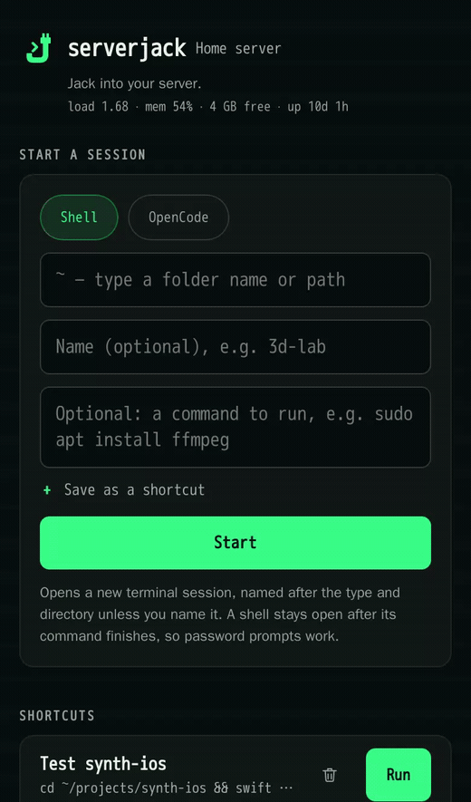
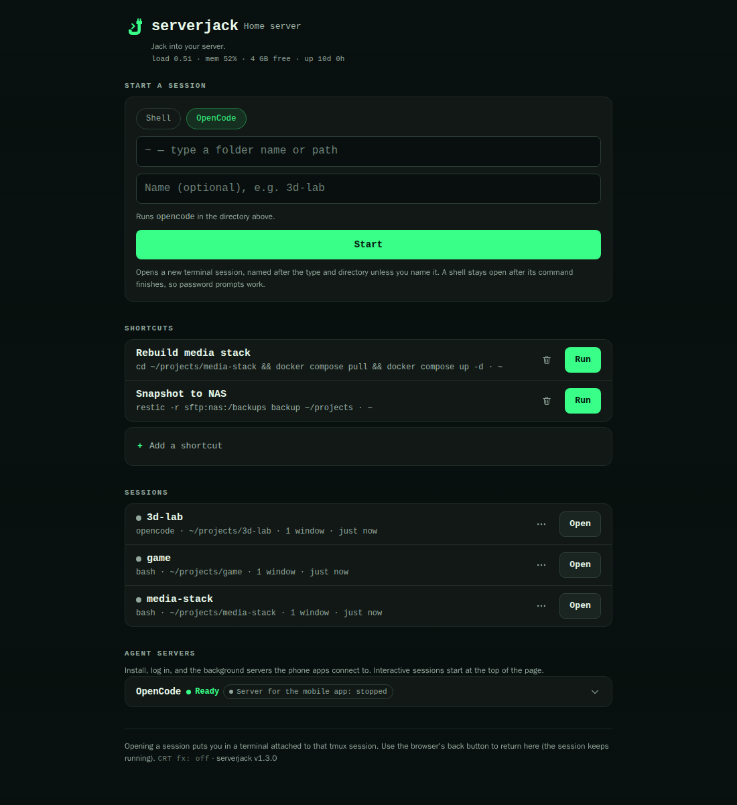
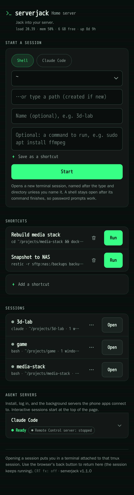
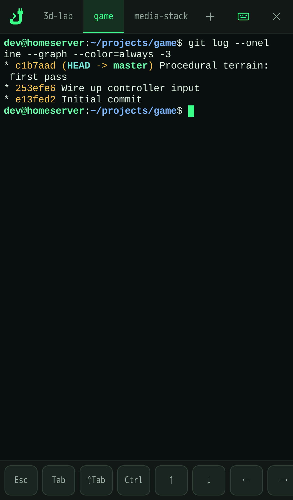

# serverjack

**Jack into your server.**

Your coding agents, from your phone. Lightweight, private, self-hosted.

[](https://github.com/jackgillette006/serverjack/actions/workflows/ci.yml)
[](LICENSE)
[](https://github.com/jackgillette006/serverjack/releases)
[](https://www.python.org/)

[Contributing](CONTRIBUTING.md) · [Security policy](SECURITY.md) · [FAQ](docs/FAQ.md) · [Changelog](CHANGELOG.md) · [MIT license](LICENSE)



| Desktop | iPhone — landing | iPhone — terminal |
|---|---|---|
|  |  |  |

- One stdlib Python file.
- No Node, no sudo, no root.
- Only reachable on your Tailscale network.
- Never phones home: no telemetry, no analytics, no update checks.
- Installs with one command.

## Quick start

Requirements: Linux, systemd, tmux, Python 3.9+ and curl. Tailscale is optional
but recommended.

```sh
curl -fsSL https://github.com/jackgillette006/serverjack/releases/latest/download/serverjack-bootstrap.sh | bash
```

That downloads one specific released version — checksummed, with the digest
embedded in the bootstrap script itself, not fetched separately — into
`~/.local/share/serverjack/`, points a `current` symlink at it, and starts it.
No checkout, no directory to remember. Prefer to look before you run it?

```sh
curl -fsSLO https://github.com/jackgillette006/serverjack/releases/latest/download/serverjack-bootstrap.sh
less serverjack-bootstrap.sh          # it's short; read it
bash serverjack-bootstrap.sh
```

Update, roll back or uninstall afterwards with the lifecycle helper it also
installs, `~/.local/bin/serverjack-ctl` — it works from the terminal even if
the web UI is unhealthy:

```sh
serverjack-ctl status                 # channel, current/previous version, health
serverjack-ctl update                 # stage + activate the latest release, or --version X.Y.Z
serverjack-ctl rollback               # back to the previous version
serverjack-ctl uninstall              # remove the managed install; config and tmux stay
```

> The command above only works once a release with these assets has been
> published (v1.4.0 will be the first — earlier tags predate this). Until
> then, or if you're developing serverjack itself, clone the repository
> instead: see [Install (no sudo)](#install-no-sudo) below, which covers both
> paths side by side.

serverjack has no password of its own. Anyone who can reach it gets a shell as
the account running it. Keep it behind `tailscale serve` (what `install.sh`
sets up) or a reverse proxy with real authentication, never `tailscale
funnel`. On a shared machine, use `install.sh --unix`; set `SERVERJACK_ALLOW`
when the tailnet has other users. Read the full
[security model](#security-model-read-this-first) or the
[FAQ](docs/FAQ.md) before exposing the service.

## Why serverjack

Start Claude Code in the right project directory, paste the `sudo` command an
agent asked you to run, or close the tmux sessions you're done with, from
your phone. serverjack is a web front door to a home server, reached over
Tailscale, your private network, from a phone or a laptop. Open a URL and you
get:

- **A real terminal.** [ttyd](https://github.com/tsl0922/ttyd) in an iframe,
  with session tabs, a tmux window picker, a phone soft-key row (Esc, Tab,
  Shift-Tab, Ctrl, arrows, ^C, PgUp/PgDn, Paste, Copy), and "Add to Home
  Screen" on iOS for a full-screen app with no browser chrome.
- **A paste-and-run box.** An agent tells you to run something it can't
  (`sudo apt install ...`, a service restart, a disk check); paste it into
  Shell and you land in that terminal watching it run.
- **Start a session.** Pick Shell or an installed agent (Claude Code, Codex,
  OpenCode, GitHub Copilot CLI, Gemini CLI) and a directory (defaults to
  `~`), and tap Start.
- **Sessions.** Every tmux session (tmux is the tool that keeps a terminal
  alive after you close the laptop) is a button on the page. Tap to attach. Any "type a path" field accepts a directory that doesn't exist
  yet and creates it, so starting a shell or an agent in a new project is one
  step. Open, rename, kill, pop out into its own window on a desktop, or hand
  off to a real SSH client.
- **Agent servers.** A collapsed row per coding CLI that still needs
  something: install, log in, or start the background server the phone app
  connects to (Claude's remote-control server, Codex's daemon and pairing,
  OpenCode's server). A tool that's ready with nothing else to configure has
  no row here — it only ever needed the picker above.
- A CRT toggle skins the whole UI (off under `prefers-reduced-motion`); the
  full effect budget is documented in
  [docs/design/DESIGN.md](docs/design/DESIGN.md#crt-effects).

See [Why this and not X](#why-this-and-not-x) for how this compares to Claude
Code Remote Control, VibeTunnel, plain ttyd, and Zellij's web client, and the
[FAQ](docs/FAQ.md) for the rest: why not plain ttyd, why not the vendors' own
remote control, why Tailscale and not a password, and whether it phones home.

## Contents

- [Start a session](#start-a-session)
  - [Update serverjack](#update-serverjack)
- [Sessions](#sessions)
  - [tmux windows](#tmux-windows)
- [Agent servers](#agent-servers)
  - [Start at boot](#start-at-boot)
- [Why this and not X](#why-this-and-not-x)
- [Security model, read this first](#security-model-read-this-first)
  - [Residual risk](#residual-risk)
- [FAQ](docs/FAQ.md)
- [Install (no sudo)](#install-no-sudo)
  - [Managed install (recommended)](#managed-install-recommended)
  - [Development install (git checkout)](#development-install-git-checkout)
  - [Two accounts on one machine](#two-accounts-on-one-machine)
  - [Updating and rolling back](#updating-and-rolling-back)
- [Configure](#configure)
  - [Tools](#tools)
- [Status line and /api/status](#status-line-and-apistatus)
- [Architecture](#architecture)
- [Tests](#tests)
- [Known limitations](#known-limitations)
- [Changelog](#changelog)
- [License](#license)

## Start a session

This is the reason serverjack exists. Coding agents can do almost everything
now except the things that need a password, a device, or a human at the
machine. When one stops and says "run this yourself", you are usually away
from the server with a phone in your hand.

Pick **Shell** or an installed agent, a directory (defaults to `~`), and tap
**Start**:

- **Shell** opens a plain login shell, or — type a command first — runs it
  **in front of** that login shell: an interactive `sudo` prompt works,
  anything that asks a question (apt, a login flow, a confirmation) works,
  and when the command finishes the session stays open at a prompt so you can
  see the output instead of watching it vanish.
- An **agent** just runs its plain command (`claude`, `codex`, ...) in the
  directory you picked. There's no separate "remote control" or "server"
  choice here — those are background processes the phone apps connect to,
  and live in [Agent servers](#agent-servers) below.

Naming the session is optional — leave it blank and it is named for the type
and directory instead (a shell in `~/projects/3d-lab` becomes `shell-3d-lab`,
`claude` in `~/projects/game` becomes `claude-game`).

Tick "Save as a shortcut" (only offered with a Shell command) and it becomes
a one-tap button in the Shortcuts list for next time. Shortcuts live in
`~/.config/serverjack/shortcuts.json`.

### Update serverjack

The Shortcuts list has one row you did not add: **Update serverjack**, marked
*built-in* and with no delete button. What it runs depends on how this copy
was installed:

- **Managed install** (the one-command bootstrap — see
  [Install (no sudo)](#install-no-sudo)): `serverjack-ctl update`. It resolves
  the latest release, stages and checksum-verifies it *without* touching the
  running one, backs up the current units and env, activates the new release,
  and waits for `/healthz` to answer before calling it done — rolling back
  automatically, with the prior units and env restored, if it doesn't.
- **Git checkout**: `cd <the checkout> && git pull --ff-only && bash
  install.sh`, exactly as before.

Either way it runs in an ordinary command session called `update`, so you
watch it scroll past and are left at a prompt with the result. The row only
appears when serverjack recognizes this as one of the two — a bare tarball
extracted by hand has neither `serverjack-ctl` nor `git pull` to run.

The unit restart either path ends in is fine from inside the browser: the
unit is `KillMode=process`, so the tmux server and this session outlive the
restart, and the page reconnects to the same session as soon as the new
process is listening.

## Sessions

Every tmux session on the box is a row: a status dot, the command, the
directory, how many windows, and how long it has been there. **Open** attaches
(a pop-out window on a desktop, the same tab on a phone). The ⋯ menu has
*Open here*, *Pop out*, the two SSH hand-offs, **Rename**, and *Kill session*.

Rename unfolds a small text box in place; the same rules as a new session
apply, so tmux's forbidden characters (`:` and `.`) and a name something else
already has are refused with the reason. Renaming a session leaves a browser
sitting on the old `/s/<name>` without a session. That is harmless: the page
notices within 15 seconds that the name is gone and moves itself to another
session, exactly as it does when a session is killed.

### tmux windows

The bar's tabs are *sessions*. Windows live inside a session, and when the one
you are looking at has more than one the active tab gains a small count badge
(`pwtest · 2/3`). Tapping the active tab opens a compact list of the windows —
index, name, and the command running in each, with the current one marked —
and tapping one selects it. With a single window the active tab does nothing,
as before.

Selecting a window is a tmux operation, not a browser one, so **every client
attached to that session moves with you** — the phone and the desktop are
looking at the same session. That is tmux, not serverjack.

## Agent servers

Interactive agent sessions start from [Start a session](#start-a-session)
above. This section is for everything else a coding CLI needs: installing
it, logging in, and starting the background server the phone apps connect to
(Claude's remote-control server, Codex's daemon and pairing, OpenCode's
server).

It's an **accordion**: one collapsed row per tool that still needs something,
so it doesn't grow past what's actually unfinished. The row itself is the
summary — tool name, state, and a pill for any server or daemon that is up —
and tapping it opens the body while closing whichever row was open (native
`<details name="agent">`, no JavaScript). serverjack never parses the tool's
output; every button just launches a command in a tmux session and shows you
the terminal.

A row is in one of three states:

1. **Not installed** — an Install button. It shows the exact command first,
   then runs the vendor's official installer in a visible terminal.
2. **Installed, not logged in** — a Log in button. These flows print a URL or
   a device code, which is fine to read and tap in a phone browser.
3. **Ready, with something to run in the background** — one **option row**
   per server, daemon or extra action: its label, a one-line note on how it
   differs from the others, and the button. They end with a quiet
   "Log in / switch account". A tool that's ready with nothing else to
   configure (Gemini CLI, by default) has no row here at all.

Background servers, per tool:

| Tool | Server / daemon |
|---|---|
| Claude Code | **Remote Control server**: `claude remote-control`, started in the directory you pick, in a tmux session named `claude-remote-<dir>`. No local chat — the Claude app starts sessions here on demand, several at once. One server per project directory, so the row lists every running one with its directory and Start adds another; prints a QR code, gives up after ~10 minutes without network |
| Codex | **Pair with phone**: `codex remote-control pair`, prints a short-lived pairing code, plus a **Remote control daemon**: `codex remote-control start` / `stop` (status from `~/.codex/app-server-daemon/app-server.pid`). The ChatGPT app connects to the daemon and opens Codex sessions in any directory on this machine |
| OpenCode | **Server for the mobile app**: `opencode serve` in tmux session `opencode-serve`. Binds 127.0.0.1:4096 by default; override `cmd` in `tools.json` to reach it over Tailscale |
| GitHub Copilot CLI | — |
| Gemini CLI | — |

Install and login commands: Claude Code
`curl -fsSL https://claude.ai/install.sh | bash` / `claude auth login`; Codex
`curl -fsSL https://chatgpt.com/codex/install.sh | sh` / `codex login`;
OpenCode `curl -fsSL https://opencode.ai/install | bash` /
`opencode auth login`; Copilot `curl -fsSL https://gh.io/copilot-install | bash`
then `/login` at its prompt; Gemini `npm install -g @google/gemini-cli`, which
signs you in on first run.

Claude Code and Codex install as single binaries and do not need Node. Gemini
CLI does; if Node isn't on the box, its row says so instead of offering a
button that would fail.

Coding CLIs like to install into a private bin directory that only your
`.bashrc` adds to `PATH`, which a systemd unit never reads. Each built-in tool
therefore lists the directories it might live in (`paths`); the ones that
exist are added to the `PATH` used for the installed/logged-in checks, the
daemon commands, and every session serverjack starts.

### Start at boot

Every server and daemon option row has a small **start at boot** checkbox. Tick
it and the thing is recorded in `~/.config/serverjack/autostart.json`:

```json
[
  {"tool": "claude", "kind": "server", "dir": "/home/you/projects/app"},
  {"tool": "codex", "kind": "daemon"}
]
```

An entry means "make sure this is running when serverjack starts". Fifteen
seconds after startup (the unit waits for `network-online.target`, and these
commands all want the network; override with `SERVERJACK_AUTOSTART_DELAY`) a
background thread walks the list: a daemon whose pidfile names no live process
is started, and a server whose session is missing — or is sitting at a dead
shell — is created in its directory. Anything already up is left alone, and
every decision is logged to `journalctl --user -u serverjack`.

Stopping something from the page **removes** its entry, so a deliberate stop
does not come back after the next restart. Starting something does not add one
unless you tick the box.

## Why this and not X

**Claude Code Remote Control, Codex remote control in the ChatGPT app, GitHub
Copilot CLI remote control, OpenCode's server plus mobile app** — use them.
They are better at driving an agent from a phone than a web terminal will ever
be, and serverjack deliberately does not compete: no agent status, no
notifications, no chat UI. They handle the agent; serverjack handles the
server. It gets those daemons installed, logged in and running in the first
place, and gives you a real terminal for everything that isn't an agent —
docker, systemd, logs, disks, the `sudo` prompt the agent can't answer.

**[VibeTunnel](https://github.com/amantus-ai/vibetunnel), agentboard, Codeman**
— genuinely good, and if you already run Node on the box, look at them. They
need Node or Bun and compile `node-pty`, which is a real dependency chain on a
minimal home server. serverjack is a Python file and a downloaded binary.

**Plain ttyd** — serverjack is ttyd plus the parts ttyd doesn't have: a
session list, a launcher, phone keys, and a page that survives a screen lock.

**Zellij's built-in web client** — nice, but only for Zellij. tmux has no
equivalent, and most servers already have tmux sessions in them.

## Security model, read this first

serverjack has **no password of its own**. Anyone who can reach it gets a
shell as the user it runs as. It is meant to be published by something that
authenticates:

- **`tailscale serve`** (what `install.sh` sets up): only devices on your
  tailnet, subject to your ACLs. Never `tailscale funnel` it.
- Or a reverse proxy with real auth in front (VPN-only, mTLS, SSO). See
  `examples/nginx.conf`.

See the [FAQ](docs/FAQ.md) for why Tailscale rather than a password, and
whether serverjack phones home (no).

Treat the URL exactly like SSH access. The app refuses cross-site POSTs and
ttyd rejects WebSockets from other origins, so a malicious web page can't
drive it from a logged-in browser, but that's hardening, not auth.

**There is one listener, and the terminal is behind it.** serverjack serves
`/term/` itself: it reverse-proxies that path — WebSocket upgrade and all — to
ttyd on `$XDG_RUNTIME_DIR/serverjack/ttyd.sock`, a socket inside a `0700`
directory that no other account and no tailnet device can open. ttyd has no
notion of a user and cannot tell who is on the other end of its socket, so it
is never exposed; every check below runs before a single byte reaches it. The
runtime directory itself is verified at startup (a real directory, not a
symlink, owned by you, mode `0700`) and serverjack refuses to start otherwise —
the `/tmp/serverjack-$UID` fallback used when there is no `$XDG_RUNTIME_DIR`
lives in a world-writable place, so its parent is checked the same way.

**Other accounts on the same machine can't reach it.** A localhost TCP port
has no owner: on a box with two logins, `curl http://127.0.0.1:7680/run` would
otherwise hand the *other* account a shell as you. So serverjack looks every
connection up in `/proc/net/tcp` and answers only root (that's `tailscaled`
proxying for `tailscale serve`) and its own user — anyone else gets a plain
403, before routing, before `/healthz`, before `/term/`. A reverse proxy running
as its own user needs its worker uid in `SERVERJACK_TRUST_UIDS`;
`SERVERJACK_TRUST_LOCAL=1` turns the check off entirely, which hands every local
account a shell, so don't. (Only the exact words `1`, `yes`, `true` or `on`
count as on — a typo, or `false`, leaves the check running.)

`SERVERJACK_LISTEN=unix` is the alternative: serverjack binds a socket in
`$XDG_RUNTIME_DIR/serverjack` too, mode `0600` inside that `0700` directory,
and the kernel does the same job with no uid list to maintain. The catch is
that `tailscale serve` will not proxy to a Unix socket for an unprivileged
caller, so that mode costs a one-time `sudo`. tcp is the default because the
no-sudo install matters more — see the residual risk at the end of this
section.

**`SERVERJACK_ALLOW` restricts an instance to named tailnet logins.**
`tailscale serve` authenticates the tailnet *device*, not the person, so on a
shared tailnet every device that can reach the port gets that account's shell.
Set `SERVERJACK_ALLOW=alice@github` (comma-separated for more) and every
request — the terminal included, because serverjack serves that too — must
carry a matching `Tailscale-User-Login` header or it gets a 403 page. The page
deliberately does *not* name the allowed logins; it says only that this
serverjack belongs to someone else and who you are signed in as. Leave `ALLOW`
unset and there is no identity check: the tailnet is the trust boundary.

**That header is only believed from a peer that could have authenticated it.**
`Tailscale-User-Login` is read when the connection's owner is root (that is
`tailscaled`, and it is what `tailscale serve` sets the header from), or a uid
you list in `SERVERJACK_TRUST_IDENTITY_UIDS`. For every other allowed peer —
your own account, a proxy uid from `SERVERJACK_TRUST_UIDS` — the header is
treated as absent, because such a peer could simply have written it. Only add a
uid to `SERVERJACK_TRUST_IDENTITY_UIDS` for a proxy that authenticates the user
itself *and* strips any copy the client sent; `examples/nginx.conf` shows both
halves.

**Only known `Host:` values are answered.** A domain someone else controls can
be pointed at `127.0.0.1` and then loaded in your browser — DNS rebinding — and
the page would be same-origin with *their* name, free to read responses and
POST back. Nothing above stops that: the connection really does come from a
browser on this machine. So every request must name a host serverjack knows:
`127.0.0.1`, `localhost`, `[::1]` (any port), this machine's hostname, its
tailnet DNS name, and anything you add in `SERVERJACK_HOSTS`. Anything else
gets `421 unknown Host` before routing. Put your own domain in
`SERVERJACK_HOSTS` if you front this with a reverse proxy.

**Cross-site POSTs are refused**, by `Sec-Fetch-Site` when the browser sends it
and by comparing `Origin` to `Host` when it doesn't. A POST carrying *neither*
is refused as well — every browser sends one of them, so its absence means the
request did not come from a page on this site. A script that means it (curl, the
test suite) says `Sec-Fetch-Site: same-origin`.

Identity comes from Tailscale, never from a password serverjack made up. If
you front it with your own proxy instead, that proxy must set
`Tailscale-User-Login` itself and strip any copy the client sent.

### Residual risk

In **tcp mode**, `tailscale serve` proxies to `127.0.0.1:7680`, and that port
belongs to whoever binds it first. While serverjack is *not* running — a crash,
a restart, the gap after `systemctl --user stop` — another local account can
bind 7680 and receive everything `tailscale serve` sends to it, including the
terminal traffic and your `Tailscale-User-Login` header. The peer-uid check
cannot help: it protects the port serverjack holds, not a port it has lost.
`Restart=on-failure` keeps retrying, so in practice the window is `RestartSec`
(3 seconds) after a crash — but it is unbounded while the unit is deliberately
stopped.

**`SERVERJACK_LISTEN=unix` is immune to this**: the socket lives in a `0700`
directory, so no other account can create it in serverjack's place. On a
machine you share with anyone, run `install.sh --unix` and paste the one
`sudo tailscale serve` line it prints. On a single-user box, tcp is fine.

Every button on the page runs a command as your user. The Agent rows run
vendor install scripts from the internet; the exact command is shown before
it runs, and it is the same one the vendor's own docs tell you to paste.

## Install (no sudo)

Requirements: Linux, systemd, tmux, python3, curl. Tailscale optional. Two
paths, same result underneath — the same `install.sh`, env file and units —
pick whichever fits:

### Managed install (recommended)

```
curl -fsSL https://github.com/jackgillette006/serverjack/releases/latest/download/serverjack-bootstrap.sh | bash
```

(needs a published release with these assets — v1.4.0 is the first; see
[Quick start](#quick-start) for the download-and-inspect alternative). The
bootstrap downloads one specific version — sha256-verified against a digest
embedded in the bootstrap script itself, not fetched separately — extracts it
to `~/.local/share/serverjack/releases/<version>/`, points a `current` symlink
at it, writes `~/.local/share/serverjack/install.json` recording the channel
and version, then hands off to that release's own `install.sh` with your
arguments and terminal intact. `--version X.Y.Z` installs a specific released
version instead of the latest one; any other flag (`--no-serve`, `--tcp`,
`--port N`, ...) passes straight through — see the flags table below. It
refuses outright, with instructions, rather than silently take over an
existing git-checkout or managed install; refuses as root; and reads any
prompt of its own from `/dev/tty`, never your terminal's `curl | bash` stdin.

Managing it afterwards — updates, rollback, uninstall — is `serverjack-ctl`
(installed to `~/.local/bin/serverjack-ctl`): see
[Updating and rolling back](#update-serverjack) above.

### Development install (git checkout)

```
git clone https://github.com/jackgillette006/serverjack
bash serverjack/install.sh
```

Clone it anywhere you keep code. The installer records that path in the user
units, and the built-in "Update serverjack" shortcut runs `git pull` there, so
leave the checkout where it is; move it and re-run `install.sh` if you must.
Use this path to develop serverjack itself or run an unreleased commit;
`serverjack-ctl` installs here too and works for `status`/`update`, but the
other subcommands (`rollback`, `uninstall`, `prune`) are managed-install-only
— a git checkout's "uninstall" is just `bash uninstall.sh` in the checkout,
same as always.

Afterwards, `bin/serverjack --check` (alias `--doctor`) runs a read-only
diagnosis, one `ok`/`warn`/`fail` line per item (Python, tmux and ttyd
versions, runtime and config directory modes, env-file permissions, Tailscale,
whether the listen address is free), and exits non-zero on any `fail`. It is
the first thing to run after a reboot that left the page unreachable.
`bin/serverjack --version` and `install.sh --version` print the version.

The installer downloads ttyd and fzf binaries into `~/.local/bin` — HTTPS
only, and verified against sha256 hashes **pinned in `install.sh` itself**, not
just against a checksum file fetched from the same host as the binary — writes
`~/.config/serverjack/env`, installs two **user** systemd units, starts them,
and publishes serverjack with `tailscale serve` on
`https://<machine>.<tailnet>.ts.net/`. That is a single mount, `/`: ttyd is not
published at all, because serverjack proxies the terminal to it.

Flags (all optional):

| Flag | Effect |
|---|---|
| `--no-serve` | skip the `tailscale serve` step entirely |
| `--tcp` | listen on `127.0.0.1` ports (the default) |
| `--unix` | listen on private Unix sockets instead — needs one `sudo tailscale serve` |
| `--port N` | serverjack's port (default `7680`); implies `--tcp` |
| `--https-port N` | HTTPS port `tailscale serve` publishes on: `443`, `8443` or `10000` (default `443`) |
| `--title NAME` | page / tab / PWA name (default the hostname) |

**Scrolling.** A finger swipe or a mouse wheel over the terminal scrolls the
tmux pane's history: the page asks serverjack, which puts the pane into
copy mode and moves it, leaving copy mode again at the bottom. Nothing in
your tmux config is touched, and a mouse drag still selects text. If a
session has `mouse on`, tmux gets the wheel directly instead.

The value flags write into `~/.config/serverjack/env` — they set the
initial value when the file is created, and rewrite just that line if you pass
one later. Everything else in the file is left alone, so editing the file by
hand and passing flags are interchangeable.

Two things need root **once per machine**. The installer detects and prints
them rather than prompting for a password:

```
sudo loginctl enable-linger $USER     # user units start at boot
sudo tailscale set --operator=$USER   # tailscale serve without sudo
```

`--unix` adds a third, which is why it is not the default: tailscale will not
proxy to a Unix socket for an unprivileged caller, even the operator —

```
401 Unauthorized: must be root, or be an operator and able to run
'sudo tailscale' to serve a path or Unix socket
```

— so in that mode the installer prints two `sudo tailscale serve … unix:…`
lines for you to paste. Serve config is persistent, so it is still once per
machine.

Then re-run `install.sh`. From here on, nothing needs sudo:

```
systemctl --user restart serverjack serverjack-ttyd   # after editing bin/ or the env file
journalctl --user -u serverjack -f
bash install.sh                                       # re-run after git pull (idempotent)
bash uninstall.sh
```

### Two accounts on one machine

serverjack is per-user by design: user systemd units, your own tmux server,
your own config, and each account sees **only its own** tmux sessions. Nothing
here needs sudo beyond the operator grant, and that is only for whoever
publishes. The second account installs with its own ports, HTTPS port and name:

```
bash install.sh --port 7690 --https-port 8443 --title serverjack-alice
```

- **Ports.** Both accounts default to 7680 (ttyd needs none — it is on a Unix
  socket in each account's own runtime dir, so those never collide). The first
  one to start wins, so the installer checks first, refuses, and prints a
  ready-to-paste command with a free port. The other account can't *use* your
  port anyway — the peer-uid check refuses it — but two processes still can't
  bind one port.
- **`tailscale serve` is machine-wide, not per-user.** Whoever runs it owns
  that (HTTPS port, path) pair for the whole machine. Each account needs one
  mount: the first takes `/` on 443; the second uses `--https-port 8443` and is reached at
  `https://<machine>.<tailnet>.ts.net:8443/` (10000 is the third and last port
  tailscale will terminate TLS on). The installer will not overwrite a mount
  that points at someone else's backend — it prints the remedy and skips serve.
  `uninstall.sh` only turns off the HTTPS port recorded in *its own*
  `SERVERJACK_HTTPS_PORT`, so it can't unpublish the other account.
- **The operator grant is *not* per user.** `tailscale set --operator=` takes a
  single Unix username for the whole machine, so only one account can run
  `tailscale serve` without sudo. Either that account runs the serve commands
  for both (the other installs with `--no-serve`), or the second account's
  install has sudo available; the installer says which case it hit.
- **`--title`.** Both accounts default the title to the hostname, so on a phone
  the two pages, tab titles and home-screen icons are indistinguishable. Give
  each account its own (`--title serverjack-alice`).
- `loginctl enable-linger` **is** per user: each account needs its own, or its
  units only run while it is logged in.

**Set `SERVERJACK_ALLOW` in each account's env file to that account's own
tailnet login.** Without it, `tailscale serve` will happily hand *any* tailnet
device that opens `:8443` a shell as alice — serve authenticates devices, not
people. With it, bob gets a 403 page — the terminal included, since serverjack
serves that itself. Per-port tailnet ACLs are worth adding on top, but they are
defense in depth, not the mechanism.

The test harness chooses unused loopback ports and an isolated tmux socket, so
concurrent runs do not share sessions or listeners.

### Updating and rolling back

**Git checkout:** re-running `install.sh` after a pull is always safe, and
from this version on it also **removes the old `/term` `tailscale serve`
mount** if your machine still has one: the terminal now goes through
serverjack, so a mount pointing straight at ttyd's port would be a way around
every check. The installer says so when it takes one down. `uninstall.sh`
turns off the `/` mount (and that old `/term` one, for installs that predate
the change).

**Managed install:** use `serverjack-ctl` instead of re-running the bootstrap
(the bootstrap refuses to touch an existing install on purpose — see
[Install (no sudo)](#install-no-sudo)):

```
serverjack-ctl status              # channel, current/previous version, health
serverjack-ctl versions            # every staged release, which is current
serverjack-ctl update [--version X.Y.Z]
serverjack-ctl rollback            # swap back to the previous version
serverjack-ctl uninstall [--yes]   # keeps ~/.config/serverjack and tmux
serverjack-ctl prune [--yes]       # delete releases other than current/previous
```

`update` resolves the latest release (or the named `--version`), downloads
and verifies it, stages it into a scratch directory under
`~/.local/share/serverjack/releases/` (only renamed into place once fully
extracted and verified) without touching the running install, backs up the
current systemd units, env file and `serverjack-ctl` itself, activates the
new release, and waits up to 30s for `/healthz` and both units being active.
If that fails, it restores the prior units, env, `serverjack-ctl` and
`current` symlink and reports it — automatically, no second command needed.
Any install flags the original bootstrap was given (most importantly
`--no-serve`) are replayed on every later `update`/`rollback`, so they don't
silently stop applying. tmux is never restarted by any of this; the units
are `KillMode=process`, so sessions (and a browser attached to one) survive
an update, a failed update's rollback, or an explicit `rollback`. Every
subcommand that changes anything asks for confirmation on `/dev/tty` unless
you pass `--yes`, and they serialize against each other with a lock file, so
a concurrent run waits rather than races.

## Configure

`~/.config/serverjack/env`:

| Variable | Default | Meaning |
|---|---|---|
| `SERVERJACK_LISTEN` | `tcp` | How **serverjack** listens; ttyd is always on `$XDG_RUNTIME_DIR/serverjack/ttyd.sock` behind it. `tcp`: the port below on `127.0.0.1`, with connections from other local accounts refused by the peer-uid check. `unix`: `web.sock` in that same `0700` directory, mode `0600` — needs one `sudo tailscale serve`, and is immune to the port-stealing risk above |
| `SERVERJACK_TRUST_UIDS` | unset | extra uids allowed to connect in `tcp` mode, comma-separated. A reverse proxy running as its own user needs its **worker** uid here (101 on `nginx:alpine`, 33 for Debian `www-data`) |
| `SERVERJACK_TRUST_LOCAL` | unset | `1` (or `yes`/`true`/`on`; nothing else) disables the peer-uid check. Only if you know why — it gives every local account a shell as you |
| `SERVERJACK_TRUST_IDENTITY_UIDS` | unset (root only) | extra uids whose `Tailscale-User-Login` header is believed. root (tailscaled) always is; every other peer's copy of that header is ignored. Only for a proxy that authenticates the user itself and strips the client's copy |
| `SERVERJACK_ALLOW` | unset | comma-separated tailnet logins (`alice@github`) allowed in. Unset = no identity check. Set = 403 for anyone else, terminal included |
| `SERVERJACK_HOSTS` | unset | extra `Host:` values to answer to, comma-separated (`term.example.com`). `127.0.0.1`, `localhost`, `[::1]`, the hostname and the tailnet DNS name are always accepted; anything else gets `421` |
| `SERVERJACK_PORT` | `7680` | serverjack's port (localhost) — `tcp` mode only |
| `SERVERJACK_HTTPS_PORT` | `443` | HTTPS port `tailscale serve` publishes on, and the only one `uninstall.sh` turns off — `443`, `8443` or `10000`. Give a second account on the machine its own |
| `SERVERJACK_TITLE` | hostname | page title, tab title, PWA name |
| `SERVERJACK_DIRS` | `~/projects:~/src:~/code:~` | directories offered when starting a session |
| `SERVERJACK_TOOLS` | unset (all) | optional comma-separated tool ids: restricts and orders the agent choices, both the Start a session radios and the Agent servers rows, e.g. `claude,codex` |
| `SERVERJACK_TERM` | `/term/` | URL path serverjack serves the terminal on (proxying it to ttyd's socket) |
| `TTYD_EXTRA_ARGS` | unset | optional ttyd client options, shell-parsed as data with no expansion. Allowed flags: `-t`/`--client-option`, `-T`/`--terminal-type`, `-m`/`--max-clients`, and `-P`/`--ping-interval`. Listener, auth, command, base-path, origin and write-access flags are refused |
| `SERVERJACK_TMUX_STATUS` | `off` | sessions opened from the page get tmux's status line turned off (the bar shows tabs and window count instead); `on` leaves tmux alone |
| `SERVERJACK_SSH` | `auto` | `user@host` for the SSH menu items (tailnet DNS name if Tailscale is up, else hostname); `off` hides them |
| `SERVERJACK_FX` | unset (on) | `off` (or `0`/`no`/`false`) turns the CRT effects off by default; each browser can still flip them with the **CRT fx** toggle |
| `SERVERJACK_CONFIG` | `~/.config/serverjack` | config directory override |
| `SERVERJACK_AUTOSTART_DELAY` | `15` | seconds after startup before `autostart.json` is acted on |

### Tools

The Agent rows come from a registry: the built-ins above, plus
`~/.config/serverjack/tools.json` if it exists. That file is a JSON **list of
objects**, merged over the built-ins by `id` — a partial object overrides just
the fields it names, `"hidden": true` removes a built-in row, and an
unrecognized `id` is appended as a new tool.

| Field | Meaning |
|---|---|
| `id` | key used for merging and for `SERVERJACK_TOOLS` |
| `label` | name shown in the row |
| `bin` | executable to look for; missing means "not installed" |
| `docs` | URL shown at the end of the row |
| `install` | shell command run by the Install button |
| `install_note` | text shown next to it |
| `needs` | `"node"` — the row explains the prerequisite if it's missing |
| `login` | shell command run by the Log in button |
| `login_note` | text shown next to it |
| `login_check` | command whose exit status 0 means "logged in" |
| `run` | interactive command; having one is what makes the tool a radio in Start a session (missing means the tool can only be installed/logged in below) |
| `run_note` | unused now, kept for compatibility with an existing `tools.json` — Start a session doesn't show a per-tool note |
| `paths` | extra directories (may use `~`) to look for `bin` in, on top of `PATH` |
| `server` | `{label, cmd, session, note, per_dir}` — long-running command kept in a named tmux session; `per_dir: true` means one per project directory, sessions named `<session>-<dir>`, each listed with its directory |
| `daemon` | `{label, start, stop, pidfile, note}` — self-daemonizing command with start/stop and a pidfile for status |
| `actions` | list of `{label, cmd, note, dir}` extra option rows; `note` is the one-liner beside it, `"dir": true` gives it the directory picker |

Example — point OpenCode's server at a different port and hide the Gemini row:

```json
[
  {
    "id": "opencode",
    "server": {
      "label": "OpenCode server",
      "cmd": "opencode serve --port 4096",
      "session": "opencode-serve",
      "note": "Pair the OpenCode mobile app with this machine's tailnet name, port 4096."
    }
  },
  { "id": "gemini", "hidden": true }
]
```

A tool session runs the tool in front of a login shell, so if it isn't
installed or isn't logged in you land on its error message and a prompt
instead of a session that vanished. Shells with a start command, the Start a
session card, and shortcuts all work the same way: the command runs, then you
get a prompt.

## Status line and /api/status

Under the tagline is one quiet line of machine state:

```
load 0.42 · mem 61% · 1.2 TB free · up 12d 4h
```

straight from `os.getloadavg()`, `/proc/meminfo`, `shutil.disk_usage($HOME)`
and `/proc/uptime`. No caching, no background thread; anything the platform
doesn't answer is simply left out.

The same numbers, plus what the agents are doing, come out of `GET
/api/status` as JSON:

```json
{
  "sessions": 6, "attached": 1,
  "agents": [{"id": "claude", "installed": true,
              "servers_running": 1, "daemon_running": false}],
  "agents_summary": "1 server · 1 daemon",
  "load": [0.42, 0.5, 0.6], "mem_used_pct": 61,
  "disk_free_gb": 1204.3, "uptime_s": 1051200, "version": "1.3.0",
  "channel": "release"
}
```

`"channel"` is `"release"` for a managed (bootstrap-installed) copy, `"git"`
for a checkout, or `"unknown"` for anything else (a bare tarball extracted by
hand). It's the same detection that decides what the "Update serverjack"
shortcut runs — see [Update serverjack](#update-serverjack).

**Counts only.** No session names, no directories, not even the agents'
labels: a dashboard should say how busy the box is, not what you called things
or where they run. This is the one route `SERVERJACK_ALLOW` cannot check an
identity on, so it is kept to numbers.

`/api/status` is exempt from `SERVERJACK_ALLOW`, for the same reason
`/healthz` is: a dashboard tile polling it is a machine, not a tailnet user, so
there is no `Tailscale-User-Login` header to match and the check could only
ever 403 it. It is **not** exempt from the peer-uid check — only root
(tailscaled), you, and any uid in `SERVERJACK_TRUST_UIDS` can open the socket
at all.

A [Homepage](https://gethomepage.dev) tile, for example — the widget's `url`
must be one the dashboard's container can reach, so use the tailnet name if
that is how it is published:

```yaml
- serverjack:
    icon: mdi-console
    href: https://myhost.my-tailnet.ts.net/
    # Quoted: an unquoted colon in a value breaks Homepage's YAML.
    description: "Jack into your server: tmux sessions, a paste-and-run box, coding agents"
    widget:
      type: customapi
      url: https://myhost.my-tailnet.ts.net/api/status
      refreshInterval: 30000
      mappings:
        - field: sessions
          label: Sessions
          format: number
        - field: attached
          label: Attached
          format: number
        - field: agents_summary
          label: Agents
          format: text
```

## Architecture

serverjack is one Python process (`bin/serverjack`) that serves the landing
page and JSON API, and reverse-proxies the terminal to a ttyd instance it
manages on a private Unix socket. [docs/ARCHITECTURE.md](docs/ARCHITECTURE.md)
is the full design write-up — request flow, process model, and the reasoning
behind each boundary; this section is the short version.

```
browser ──HTTPS──▶ tailscale serve ── / ──▶ 127.0.0.1:7680  bin/serverjack
                                              │   the page, the JSON API, and
                                              │   /term/ reverse-proxied to:
                                              └─▶ $XDG_RUNTIME_DIR/serverjack/ttyd.sock  ttyd
                                                    └─▶ bin/tmux-attach.sh <session> ──▶ tmux attach
```

**One `tailscale serve` mount, `/`.** ttyd is never published: it listens only
on that Unix socket, inside a `0700` directory, and serverjack forwards
everything under `SERVERJACK_TERM` to it — request line with the prefix
stripped, headers verbatim (so ttyd's own origin check still sees the real
`Host` and `Origin`), then raw bytes in both directions once the WebSocket
upgrade succeeds. If ttyd is down you get a 502 page saying so, in the frame.

(In `SERVERJACK_LISTEN=unix` mode serverjack's own backend is
`$XDG_RUNTIME_DIR/serverjack/web.sock` instead of the port.)

Both services run as you and talk to your normal tmux server, so the sessions
shown are the same ones `tmux ls` shows in any other login — including the
ones an Install button or the Start a session card started. Opening a
session loads `/s/<name>`,
whose bar sits over an iframe of `/term/?arg=<name>`; ttyd passes that one
argument to `tmux-attach.sh`, which attaches. There is no no-argument fallback,
so `bin/tmux-picker.sh` is only for use from a real terminal.

The units use `KillMode=process` on purpose: if the browser is the first thing
to create a tmux session after boot, the tmux server is a child of the unit,
and a default restart would take every session down with it.

## Tests

`tests/run.sh` runs real browsers (Chromium, Firefox, WebKit with iPhone
emulation) in a Playwright container straight against serverjack — no proxy in
the middle any more, since serverjack serves the terminal itself — and reads the
tmux pane from the host to prove keystrokes arrived. It starts two instances on
scratch ports, each with its own scratch runtime dir (and so its own
`ttyd.sock`), so docker is the only thing that has to be installed and a real
install is never touched. One of the suites (`pwauth`) drives the instance with
`SERVERJACK_ALLOW` set, plays the part of `tailscale serve` by sending the
identity header, and proves the terminal is behind that check — both a page
fetch and a raw WebSocket handshake to `/term/ws` are refused without it.
Host-side checks prove the peer-uid rule by curling from containers running as
uid 65534, 0 and 101 (including `/term/`), that an unknown `Host:` gets 421, and
that the terminal's WebSocket accepts a same-origin and refuses a foreign
origin through the proxy; another starts a throwaway instance with an
`autostart.json` pointing at a fake server to prove it comes up on its own.
`docs/MANUAL-TESTS.md` is a checklist for real devices; iOS Safari's
soft-keyboard behavior is only verifiable there.

`tests/managed-install.sh` covers the release/bootstrap/`serverjack-ctl` path
separately: a privileged, throwaway Debian 13 systemd container with **no
git** and no GitHub reachable for the serverjack release itself (a
`python3 -m http.server` on a private docker network stands in). It proves a
piped bootstrap install, that a rerun preserves the env file and a shortcut,
that `serverjack-ctl update` activates a second release while a live tmux
session survives, that updating to a deliberately broken release is refused
and auto-rolled-back, that a no-`--yes` update with no controlling terminal
refuses cleanly instead of hanging, that `rollback` works, that a truncated
download and a corrupted archive are both refused with nothing staged, that
`uninstall --yes` keeps config and tmux, and that running as root is refused.
Optional and host-side — needs docker able to run `--privileged` containers
with real systemd, and skips itself with a message otherwise. `bash
tests/run.sh` runs it as part of the full suite; `bash tests/run.sh
managed-install` runs just that.

## Known limitations

- Linux WebKit browsers (Epiphany) still need Ctrl+Shift+C to copy.
- While scrolled back, the pane is in tmux copy mode: keys go to copy mode
  until you scroll to the bottom or press Esc/`q`. That's tmux.
- tmux resizes a session to its most recent client, so a phone attaching
  shrinks the desktop view until the desktop sends a key. That's tmux.
- Installer and units are Linux + systemd only.

## Changelog

See [CHANGELOG.md](CHANGELOG.md) for released and unreleased changes.

## License

MIT. See [LICENSE](LICENSE).
