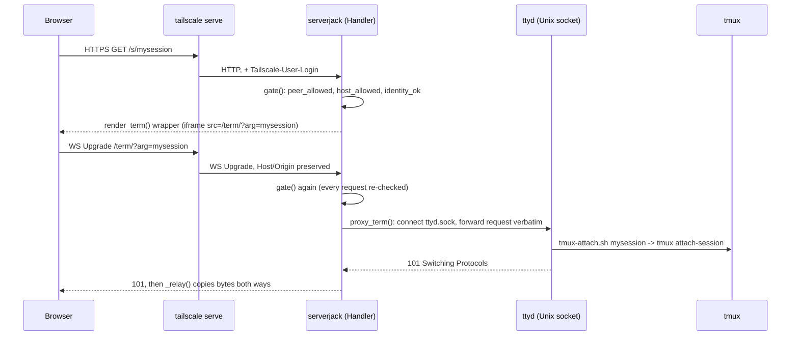

# Architecture

serverjack is one process (`bin/serverjack`): a stdlib-only Python HTTP
server that serves a landing page, a per-session terminal wrapper, and a
JSON API, and reverse-proxies a second process (ttyd) to put a real
terminal in the browser. A companion shell script (`bin/serverjack-ttyd`)
starts that second process. Nothing else runs. Every claim below cites the
function or file it comes from.

## Request flow

```
tailscale serve (HTTPS termination, adds Tailscale-User-Login)
        │
        ▼
  loopback TCP 127.0.0.1:<port>          (SERVERJACK_LISTEN=tcp, default)
        or a 0600 Unix socket             (SERVERJACK_LISTEN=unix)
        │
        ▼
  bin/serverjack  (Handler.gate: peer_allowed, host_allowed, identity_ok)
        │
        ├─ "/", "/s/<name>", "/api/*", "/app.js" ... -> handled in-process
        │
        └─ path under SERVERJACK_TERM (default "/term/")
                -> Handler.proxy_term()
                        │  AF_UNIX socket <runtime dir>/ttyd.sock
                        ▼
                ttyd  -> bin/tmux-attach.sh <name> -> tmux attach-session
```

Every request — the WebSocket included — passes `Handler.gate()` before
anything else runs. There is one listening socket and one set of checks;
ttyd's socket is reachable by nothing else.



## Security model, as implemented

serverjack has no login of its own — every button runs a shell command as
the account it runs under ("SSH with a nicer font"). The checks below
stand in for a password.

**Connection ownership (`SERVERJACK_LISTEN`, peer-uid).** In `tcp` mode
(default, `BIND` from `SERVERJACK_PORT`), a loopback port has no owner by
itself, so `Handler.setup()` calls `conn_uid(self.connection)` once per
connection. For `AF_UNIX` it reads `SO_PEERCRED` directly; for TCP,
`peer_uid()` greps the connection's 4-tuple out of `/proc/net/tcp[6]`
(`_proc_addr()` decodes the hex, little-endian fields; `_norm()` strips the
`::ffff:` prefix) and reads the owning uid from that row. `peer_allowed(uid)`
fails **closed**: an unidentifiable peer (`uid is None`) is refused, with a
one-time stderr hint to use `SERVERJACK_TRUST_LOCAL=1` or
`SERVERJACK_LISTEN=unix`. `ALLOWED_UIDS` is root (tailscaled), our own uid,
and anything in `SERVERJACK_TRUST_UIDS`. `SERVERJACK_TRUST_LOCAL` (parsed by
the strict `env_flag()`, which only accepts `1`/`yes`/`true`/`on` — a typo
leaves the check *on*) disables it entirely. `Handler.gate()` runs this
first; a refusal is a flat 403 (`refuse_peer()`), no page rendered. In
`unix` mode none of this runs: `web.sock` is `0600` inside a `0700`
directory and the kernel enforces it. `UnixHTTPServer.server_bind()`
refuses to replace a non-socket path, chmods the fresh socket `0600`, and
records its `(st_dev, st_ino)` so `server_close()` only unlinks the exact
inode it created.

**The runtime directory (`safe_dir()`).** Both sockets live under
`$XDG_RUNTIME_DIR/serverjack` (or `/tmp/serverjack-$UID/serverjack` if
unset — the world-writable fallback `safe_dir()` exists for).
`safe_dir(path, what)` — mirrored in shell as `check_dir()` in both
`bin/serverjack-ttyd` and `bin/tmux-attach.sh` — requires `lstat()` to show
a real directory, not a symlink, owned by our uid, mode exactly `0700`
(fixed with `chmod` if drifted; wrong owner or a symlink is fatal, never
repaired). A local account that could own or read into that directory
could plant its own socket where ttyd's belongs.

**`TRUST_IDENTITY_UIDS` vs. `Tailscale-User-Login`.** `tailscale serve`
authenticates the user and injects the header. `Handler.identity_ok(path)`
only believes it when `self.peer` is in `TRUST_IDENTITY_UIDS` (root by
default, plus `SERVERJACK_TRUST_IDENTITY_UIDS`). Every other allowed peer —
our own account, a `SERVERJACK_TRUST_UIDS` proxy — could set that header
itself, so for them it's treated as absent, not merely unverified: being
allowed to *connect* and being trusted to *vouch for an identity* are
separate sets.

**`SERVERJACK_ALLOW`.** When set (comma-separated, lowercased logins),
`identity_ok()` requires the trusted header to match for every request,
GET and POST, terminal included (`gate()` runs before `proxy_term()`).
`Handler.OPEN_PATHS = ("/healthz", "/api/status")` are exempt on GET only —
both are machine probes with no tailnet identity to check, still behind
peer-uid, and `status()` reports counts only, never session names or
paths. A denied request gets `render_deny()` (browser) or
`{"error": "not your serverjack"}` (`/api/*`).

**Host validation (`host_allowed()`).** A hostname someone else controls
can be pointed at `127.0.0.1` and loaded in a browser (DNS rebinding); the
connection really is local, so peer-uid doesn't help. `host_allowed()`
checks the parsed hostname (`_hostname_of()`) against `ALLOWED_HOSTS`
(seeded by `_base_hosts()`: loopback spellings, this machine's hostname,
`SERVERJACK_HOSTS`) plus the tailnet DNS name (`self_dns_name()` via
`tailscale status --json`, cached and refreshed once lazily under
`_hosts_lock`). Anything else is a 421 (`refuse_host()`) — plain text, not
a rendered page.

**CSRF (`same_site()`).** `do_POST` calls this before touching the body. It
prefers `Sec-Fetch-Site` (`same-origin`/`none` pass); falls back to
comparing `Origin`'s host against `Host`/`X-Forwarded-Host`; with **neither**
header, it refuses outright — a deliberate "assume nothing," since every
current browser sends one or the other on a form POST.

**Body-size / `Content-Length` (`Handler.form()`).** Chunked
(`Transfer-Encoding`) is rejected outright. More than one `Content-Length`,
or a non-decimal value, is 400 (rejecting non-numeric values, rather than
letting `int()` raise, also closes off smuggling tricks that rely on
parsers disagreeing which length is authoritative). A value over 10 digits
is treated as `65537` without calling `int()` on it. Anything over 65536
bytes is 413. Every rejection closes the connection — the parser can no
longer trust where the next request starts.

**Atomic, owner-only writes (`save_private_json()`).** Shortcuts can
contain arbitrary commands and autostart entries expose paths, so neither
file is written in place: `mkstemp()` inside `CONFIG_DIR` (re-asserted via
`safe_dir()`), `fchmod(0o600)` before any content, then `os.replace()` —
atomic on the same filesystem, never a half-written file visible to a
reader.

**Symlink-safe socket paths.** `UnixHTTPServer.server_bind()` and
`serverjack-ttyd`'s socket setup both `lstat()` first and require an
existing path to already be a socket — never a symlink, even one resolving
to a socket — before unlinking a stale one from a hard kill.

**`TTYD_EXTRA_ARGS` allowlist.** A convenience string from the systemd
`EnvironmentFile`, treated as data, never `eval`'d: `bin/serverjack-ttyd`
parses it with `shlex.split()` inside a `python3 -c` one-liner, writes the
words NUL-separated to a temp file, reads them back with `mapfile -d ''`
(preserving argument boundaries), then matches each against a fixed
allowlist — `-t`/`--client-option`, `-T`/`--terminal-type`,
`-m`/`--max-clients`, `-P`/`--ping-interval` (each needs exactly one
following non-flag value) and their `--flag=value` spellings. Anything
else — `-i`, `-W`, `-O`, an unterminated quote — fails before `exec`.
`tests/security-wrapper.sh` proves both the exact argv for safe input and
that unsafe input never reaches a fake `ttyd`.

## The WebSocket proxy

ttyd binds only `ttyd.sock`; only this process dials it. `proxy_term()`
(called from `do_GET`, after `gate()`) is a raw byte relay built for two
request shapes:

1. Rebuild the upstream target from the *parsed* request
   (`urlparse(self.path)`, not a slice of `self.path`) so an absolute-form
   request target doesn't mis-strip `TERM_PREFIX`.
2. Detect an upgrade via `Upgrade: websocket` **and** `Connection: ...
   upgrade` (both required).
3. Forward headers verbatim except a fixed hop-by-hop set (`HOP_HEADERS`).
   `Host`/`Origin` pass through unchanged — ttyd's `-O` flag compares them.
   A non-upgrade request is forced to `Connection: close`.
4. `_read_head()` accumulates from ttyd until `\r\n\r\n` (64KB cap), then
   returns the head plus any trailing bytes already read past it. If ttyd
   closes without answering during an upgrade, that's its `-O` silently
   refusing a cross-origin socket — `proxy_term()` says nothing back rather
   than claim the terminal is down.
5. `_relay()` pumps bytes both ways for the rest of the connection's life:
   client→ttyd on a daemon thread reading `self.rfile` (not a raw `recv()`,
   since the buffered request parser may hold bytes the socket won't
   present again), ttyd→client on the calling thread. Either side closing
   triggers a shutdown of the other; the reader thread is joined with a
   5-second timeout. No idle timeout on the upstream socket
   (`up.settimeout(None)`) — a terminal is meant to sit idle for hours;
   ttyd's own reconnect and the browser handle a dropped network path.

## tmux integration

`bin/tmux-attach.sh` is ttyd's command (`-a` turns `?arg=` into `$1`). It
re-checks the runtime directory with its own `check_dir()`, then
`tmux has-session -t "=$name"` and, on success, `exec tmux attach-session
-t "=$name"` — no `-d`, so opening from a phone never detaches another
client. A missing session prints a message and sleeps 20 seconds (long
enough that the page's 15-second `/api/sessions` poll has already moved
the browser elsewhere). `bin/tmux-picker.sh` (an fzf menu over the same
tmux server) is no longer reachable through the web app at all — it's kept
only for running by hand.

Server-side, every operation goes through the `tmux()` wrapper and a
machine-parseable `-F` format: `sessions()`/`windows()` list state;
`session_mouse()`/`scroll_session()` drive tmux's mouse and copy modes from
outside it — `scroll_session()` branches on `#{alternate_on}` (full-screen
apps like an agent CLI's TUI have no scrollback, so they get
`PageUp`/`PageDown` instead, accumulated in `_SCROLL_ACC` so small scroll
deltas don't each flip a page); `screen_text()` backs `/api/screen` and the
phone "Copy" view; `create_session()`/`command_args()` pass the command in
through an environment variable (`SERVERJACK_CMD`), never interpolated
into a shell string, run in front of a login shell so `sudo` can prompt and
the last output stays on screen (`set -m` gives it its own process group,
which is what `session_idle()`'s "fell back to a bare shell" check keys
on).

## Agent registry

`BUILTIN_TOOLS` is a plain list of dicts for five coding CLIs.
`load_tools()` merges `$SERVERJACK_CONFIG/tools.json` over it: existing ids
are `dict.update()`d field by field (`server`/`daemon` replace wholesale),
unknown ids are appended, `"hidden": true` drops one. A malformed file is
caught and surfaced as a page error string, never taking the page down.
`SERVERJACK_TOOLS` further restricts and reorders the visible set.
`tool_state()` (installed? logged in? server/daemon running?) is cached 60s
per tool (`_STATE_CACHE`), cleared by any button that touches that tool;
`tool_states()` fans a whole list out over a `ThreadPoolExecutor` so
rendering costs about one login check, not one per tool. `_tool_path()`
folds each tool's `paths` plus nvm's version directories into one extra
`PATH` computed once at startup, since a systemd user unit's `PATH` never
sourced the shell profile a CLI's installer relied on.

## Autostart

`autostart.json` lists `{"tool", "kind": "server"|"daemon", "dir"}`
entries. `autostart_boot()` runs once in a daemon thread started just
before `serve_forever()` (so the page comes up immediately), after
sleeping `SERVERJACK_AUTOSTART_DELAY` seconds (default 15, since
`network-online.target` firing isn't the same as DNS answering).
`autostart_start_one()` is idempotent: a live daemon or a non-idle server
session is left alone; an idle (exited-to-shell) session is killed and
recreated. Stopping something from the page calls `drop_autostart()` so a
deliberate stop doesn't return on the next restart.

## Install channels

Two ways to get `bin/serverjack` onto a machine, both ending in the same
`install.sh` doing the same work (ttyd/fzf, the env file, the units, `serve`).
`bin/serverjack`'s own `_install_channel()` tells them apart at import time,
read once and reported in `/api/status`'s `"channel"` field and behind the
"Update serverjack" shortcut (`UPDATE_CMD`/`update_available()`):

- **`git`** — `REPO` (`bin/serverjack`'s own directory, two levels up) has a
  `.git` next to it. `git pull --ff-only && bash install.sh` is both the
  update shortcut and the whole story: nothing else is versioned here.
- **`release`** — `~/.local/share/serverjack/install.json` says
  `"channel": "release"`. This is the bootstrap/`serverjack-ctl` path:
  - `scripts/build-release.sh <version>` packages `bin/`, `systemd/`,
    `install.sh`, `uninstall.sh`, docs and a `RELEASE` file (version, git SHA,
    build date) into `dist/serverjack-<version>.tar.gz`, refusing to build if
    `VERSION` in `bin/serverjack` disagrees with `<version>`, and renders
    `dist/serverjack-bootstrap.sh` from `bootstrap/serverjack-bootstrap.sh.in`
    with that archive's URL and sha256 embedded. `.github/workflows/release.yml`
    runs it on a pushed `v*` tag and attaches all three (archive, bootstrap,
    `SHA256SUMS`) to a draft GitHub release.
  - The rendered bootstrap is a single downloadable script: refuses root and
    an existing install (git or managed) outright, downloads and
    checksum-verifies the archive (against the embedded digest by default, or
    a downloaded `SHA256SUMS` for an explicit `--version`), extracts it to
    `~/.local/share/serverjack/releases/<version>/`, atomically symlinks
    `~/.local/share/serverjack/current` at it, writes `install.json`, then
    `exec`s that release's `bin/serverjack-setup` (see **Guided setup**
    below) with the caller's own args and terminal, which itself ends by
    running `install.sh`. Every function is defined before `main "$@"` runs
    as the very last line, so a truncated `curl | bash` transfer hits an
    unterminated function body and a syntax error before anything executes —
    never a partial install. The `for c in curl sha256sum tar python3
    systemctl flock` precheck near the top is deliberately narrow: only what
    THIS stage itself uses (staging the release, its own lock) — NOT tmux or
    anything else install.sh needs, because finding and offering to install
    actual missing prerequisites is `serverjack-setup`'s job, next.
  - `install.sh` detects it is running from inside
    `.../releases/<v>/` (by realpath prefix on its own resolved location) and
    bakes the STABLE `.../current/...` path into the systemd units'
    `ExecStart` instead of that specific release directory (`UNIT_REPO` vs.
    `REPO` in the script) — so a later release only needs its symlink swapped
    and the units restarted, never reinstalled. It also always installs
    `bin/serverjack-ctl` to `~/.local/bin/`, for both channels.
  - `bin/serverjack-ctl` (`status`/`versions`/`update`/`rollback`/
    `uninstall`/`prune`) is the lifecycle helper: `update` stages a release
    into a scratch directory under `releases/` (only renamed into its final
    `releases/<version>/` name once fully extracted and checksum-verified —
    the version currently `current` resolves to is never removed to make
    room, including for a same-version no-op), backs up the current units,
    env and `serverjack-ctl` itself, swaps `current`, re-runs `install.sh`
    with the install flags (e.g. `--no-serve`) persisted from the original
    bootstrap in `install.json`'s `install_args`, and waits on `/healthz`
    plus both units being active — restoring the backup automatically on
    failure. (Health deliberately does not probe `/term/`: unlike
    `/healthz`, it is not in `Handler.OPEN_PATHS`, so a `SERVERJACK_ALLOW`-
    restricted install would 403 every probe and auto-roll-back a perfectly
    healthy update.) `rollback` does the same using `install.json`'s
    `previous` field. Every mutating subcommand takes an `flock` on
    `~/.local/share/serverjack/.lock` and asks for confirmation on
    `/dev/tty` unless `--yes`. `SERVERJACK_RELEASE_BASE_URL` overrides the
    GitHub base URL both the bootstrap and `serverjack-ctl` resolve archives
    against — a test/enterprise-mirror hook, exercised by
    `tests/managed-install.sh` against a `python3 -m http.server` so the
    container test needs no GitHub reachability for the release itself.

## Guided setup

`bin/serverjack-setup` is what the bootstrap execs before `install.sh` (also
runnable by hand from a checkout, and aliased as `serverjack-ctl setup`),
and it's the only place in this project that prompts interactively: refuse
root/`SUDO_USER` misuse; confirm a supported OS/arch with a working
`systemd --user`; find actually-missing prerequisites and offer one
`apt-get install`; refuse an unrecognized existing install or another
account's serverjack on the port (or, on this account's own managed install,
show state and offer update/allow-list/publish/nothing instead — a rerun,
not a refusal); offer Tailscale install/sign-in or `--no-serve`; if
publishing, ask who may reach it (`SERVERJACK_ALLOW`); ask about `--unix`;
run the one-time root steps inline; then run `install.sh` and verify
units, `/healthz`, and the tailnet URL. Every question has a matching
`install.sh`-style flag that skips it, so a fully-flagged invocation never
touches `/dev/tty` at all — this is what lets `tests/managed-install.sh`'s
`curl | bash -s -- --no-serve` scenario keep working unattended even though
the bootstrap now always hands off here first. `/dev/tty` itself is opened
lazily (`ensure_tty()`, on the first prompt actually reached, not up front)
for the same reason: a run with nothing left to ask never needs a
controlling terminal, and one that does gets exactly one open attempt and
the same clean "here's what's left" stop on failure. The resolved flags are
recorded as `install.json`'s `"install_args"` so `serverjack-ctl update`
replays the same choices on every later update rather than reverting to
`install.sh`'s own defaults. `tests/guided-install.sh` drives all of this
through a REAL pty (`tests/guided-install-driver.py`, `script -qfc '...'
/dev/null`) against a fake `tailscale` binary
(`tests/fixtures/fake-tailscale.sh`) standing in for the real thing.

## Single-file, stdlib-only: rationale and tradeoffs

The whole app — HTTP handling, HTML/CSS/JS templates, tmux driver, agent
registry, config I/O — is one file with no import outside the standard
library. That means it drops onto a bare box with no package manager or
lockfile to drift, the entire request path is readable in one file with no
import graph to chase, and there's no supply chain beyond CPython and the
external `tmux`/`ttyd` binaries.

The tradeoffs are as direct. At ~3,500 lines, HTTP handling, HTML
generation, and process management share one namespace with no module
boundary between them. Testing is necessarily black-box — a real process
driven by real HTTP/WebSocket clients — because module-level side effects
(`RUNTIME_DIR = runtime_dir()`, `TOOL_PATH = _tool_path()`, the tailnet DNS
lookup) run on import, which is also why the test strategy below leans on
Playwright and host-side socket checks rather than a unit-test pyramid.
And `str.format()`-templated HTML built by string concatenation has no
auto-escaping runtime behind it — every new field rendered into a page
must be passed through `esc()` (`html.escape(..., quote=True)`) by the
author's own discipline, not enforced by the framework, because there
isn't one.

## Test strategy

**Playwright suites** (`tests/pw*.py`, run in the
`mcr.microsoft.com/playwright/python` container by `tests/run.sh`) drive
real browser engines and prove behavior by **reading the tmux pane
directly** (`tmux -S "$TMUX_SOCK" capture-pane`), not by trusting the DOM:
- `pwtest.py` — typing reaches the shell; Ctrl+C sends SIGINT with no
  selection; the tab bar reflects the attached session.
- `pwclip.py` — clipboard copy across Chromium/Firefox/WebKit. Linux
  WebKit (Epiphany-style) is a known, accepted failure, reported but not
  counted against the suite.
- `pwmobile.py` — soft keys, Paste, and the "Copy" screen-text view, on
  desktop and WebKit's iPhone 14 emulation (not real iOS Safari).
- `pwpop.py` — pop-out-to-window behavior and that reopening the same
  session refocuses rather than duplicates.
- `pwwin.py` — the window-count badge and picker, verified against
  `tmux display -p '#{window_index}'`.
- `pwland.py` — the Start a session card really starts a shell or an agent
  session, a shortcut round-trips through `shortcuts.json`, and an
  agent-servers card's buttons hit the routes they claim, against two fake
  (`bin=true`) tools from a throwaway `tools.json`.
- `pwauth.py` — `SERVERJACK_ALLOW` end-to-end against a second scratch
  instance, with Playwright forging (or withholding) the
  `Tailscale-User-Login` header itself: wrong/missing header is a 403 that
  doesn't name the real owner; the allowed header attaches an actual tmux
  client; a raw WebSocket handshake with no header is refused with no new
  client spawned — proving identity covers the proxied terminal too.

**`security_http.py`** (host-side) checks HTTP-parser behavior needing no
browser: the two `OPEN_PATHS` still require identity on **POST** against
the restricted instance, and a table of malformed `Content-Length` values
(`invalid`, `-1`, `65537`) each get the exact status `form()` produces
(400, 400, 413), sent over a raw socket to bypass `http.client`'s own
validation.

**`security-wrapper.sh`** exercises `bin/serverjack-ttyd` against a fake
`ttyd` on `PATH` that just records its argv: proves the exact argv for
safe `TTYD_EXTRA_ARGS`, that unsafe ones never reach exec, and that an
existing non-socket file at the `ttyd.sock` path is left untouched.

**`tests/run.sh`** itself also drives: Host-header validation (bad Host on
`/`, `/healthz`, `/term/` all 421); the peer-uid check (`docker run --user
65534` gets 403 on `/` and `/term/`; uid 0 and a configured
`SERVERJACK_TRUST_UIDS` value get in); the WebSocket origin check through
the proxy (`bin/ttyd-ws-check.py` — same-origin reaches 101, foreign
`Origin` doesn't); and autostart (a fake server plus a matching
`autostart.json` on a 2-second delay produces a live tmux session with no
button pressed).

**What only manual tests cover** (`docs/MANUAL-TESTS.md`): a real coding
CLI actually installed and authenticated (the automated suites only ever
exercise `bin=true` fakes), a real `tailscale serve` deployment rather than
Playwright forging the header, and real mobile Safari/Chrome — the WebKit
"iPhone 14" device is desktop WebKit with touch events and a phone
viewport, not the actual iOS engine.
