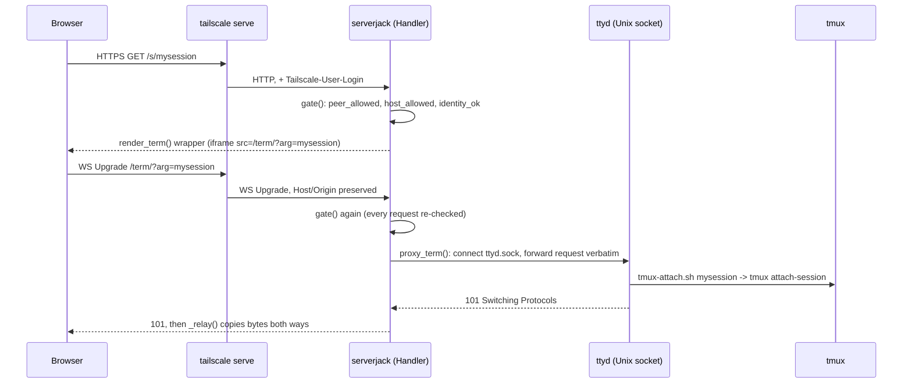

# Architecture

serverjack is one process (`bin/serverjack`): a stdlib-only Python HTTP
server that serves a landing page, a per-session terminal wrapper, and a
JSON API, and reverse-proxies a second process (ttyd) to put a real
terminal in the browser. A companion shell script (`bin/serverjack-ttyd`)
starts that second process. Nothing else runs. Every claim below cites the
function or file it comes from.

## Request flow

```
tailscale serve (HTTPS termination, adds Tailscale-User-Login)
        │
        ▼
  loopback TCP 127.0.0.1:<port>          (SERVERJACK_LISTEN=tcp, default)
        or a 0600 Unix socket             (SERVERJACK_LISTEN=unix)
        │
        ▼
  bin/serverjack  (Handler.gate: peer_allowed, host_allowed, identity_ok)
        │
        ├─ "/", "/s/<name>", "/api/*", "/app.js" ... -> handled in-process
        │
        └─ path under SERVERJACK_TERM (default "/term/")
                -> Handler.proxy_term()
                        │  AF_UNIX socket <runtime dir>/ttyd.sock
                        ▼
                ttyd  -> bin/tmux-attach.sh <name> -> tmux attach-session
```

Every request — the WebSocket included — passes `Handler.gate()` before
anything else runs. There is one listening socket and one set of checks;
ttyd's socket is reachable by nothing else.


```mermaid
sequenceDiagram
    participant B as Browser
    participant TS as tailscale serve
    participant SJ as serverjack (Handler)
    participant TT as ttyd (Unix socket)
    participant TM as tmux

    B->>TS: HTTPS GET /s/mysession
    TS->>SJ: HTTP, + Tailscale-User-Login
    SJ->>SJ: gate(): peer_allowed, host_allowed, identity_ok
    SJ-->>B: render_term() wrapper (iframe src=/term/?arg=mysession)
    B->>TS: WS Upgrade /term/?arg=mysession
    TS->>SJ: WS Upgrade, Host/Origin preserved
    SJ->>SJ: gate() again (every request re-checked)
    SJ->>TT: proxy_term(): connect ttyd.sock, forward request verbatim
    TT->>TM: tmux-attach.sh mysession -> tmux attach-session
    TT-->>SJ: 101 Switching Protocols
    SJ-->>B: 101, then _relay() copies bytes both ways
```

## Security model, as implemented

serverjack has no login of its own — every button runs a shell command as
the account it runs under ("SSH with a nicer font"). The checks below
stand in for a password.

**Connection ownership (`SERVERJACK_LISTEN`, peer-uid).** In `tcp` mode
(default, `BIND` from `SERVERJACK_PORT`), a loopback port has no owner by
itself, so `Handler.setup()` calls `conn_uid(self.connection)` once per
connection. For `AF_UNIX` it reads `SO_PEERCRED` directly; for TCP,
`peer_uid()` greps the connection's 4-tuple out of `/proc/net/tcp[6]`
(`_proc_addr()` decodes the hex, little-endian fields; `_norm()` strips the
`::ffff:` prefix) and reads the owning uid from that row. `peer_allowed(uid)`
fails **closed**: an unidentifiable peer (`uid is None`) is refused, with a
one-time stderr hint to use `SERVERJACK_TRUST_LOCAL=1` or
`SERVERJACK_LISTEN=unix`. `ALLOWED_UIDS` is root (tailscaled), our own uid,
and anything in `SERVERJACK_TRUST_UIDS`. `SERVERJACK_TRUST_LOCAL` (parsed by
the strict `env_flag()`, which only accepts `1`/`yes`/`true`/`on` — a typo
leaves the check *on*) disables it entirely. `Handler.gate()` runs this
first; a refusal is a flat 403 (`refuse_peer()`), no page rendered. In
`unix` mode none of this runs: `web.sock` is `0600` inside a `0700`
directory and the kernel enforces it. `UnixHTTPServer.server_bind()`
refuses to replace a non-socket path, chmods the fresh socket `0600`, and
records its `(st_dev, st_ino)` so `server_close()` only unlinks the exact
inode it created.

**The runtime directory (`safe_dir()`).** Both sockets live under
`$XDG_RUNTIME_DIR/serverjack` (or `/tmp/serverjack-$UID/serverjack` if
unset — the world-writable fallback `safe_dir()` exists for).
`safe_dir(path, what)` — mirrored in shell as `check_dir()` in both
`bin/serverjack-ttyd` and `bin/tmux-attach.sh` — requires `lstat()` to show
a real directory, not a symlink, owned by our uid, mode exactly `0700`
(fixed with `chmod` if drifted; wrong owner or a symlink is fatal, never
repaired). A local account that could own or read into that directory
could plant its own socket where ttyd's belongs.

**`TRUST_IDENTITY_UIDS` vs. `Tailscale-User-Login`.** `tailscale serve`
authenticates the user and injects the header. `Handler.identity_ok(path)`
only believes it when `self.peer` is in `TRUST_IDENTITY_UIDS` (root by
default, plus `SERVERJACK_TRUST_IDENTITY_UIDS`). Every other allowed peer —
our own account, a `SERVERJACK_TRUST_UIDS` proxy — could set that header
itself, so for them it's treated as absent, not merely unverified: being
allowed to *connect* and being trusted to *vouch for an identity* are
separate sets.

**`SERVERJACK_ALLOW`.** When set (comma-separated, lowercased logins),
`identity_ok()` requires the trusted header to match for every request,
GET and POST, terminal included (`gate()` runs before `proxy_term()`).
`Handler.OPEN_PATHS = ("/healthz", "/api/status")` are exempt on GET only —
both are machine probes with no tailnet identity to check, still behind
peer-uid, and `status()` reports counts only, never session names or
paths. A denied request gets `render_deny()` (browser) or
`{"error": "not your serverjack"}` (`/api/*`).

**Host validation (`host_allowed()`).** A hostname someone else controls
can be pointed at `127.0.0.1` and loaded in a browser (DNS rebinding); the
connection really is local, so peer-uid doesn't help. `host_allowed()`
checks the parsed hostname (`_hostname_of()`) against `ALLOWED_HOSTS`
(seeded by `_base_hosts()`: loopback spellings, this machine's hostname,
`SERVERJACK_HOSTS`) plus the tailnet DNS name (`self_dns_name()` via
`tailscale status --json`, cached and refreshed once lazily under
`_hosts_lock`). Anything else is a 421 (`refuse_host()`) — plain text, not
a rendered page.

**CSRF (`same_site()`).** `do_POST` calls this before touching the body. It
prefers `Sec-Fetch-Site` (`same-origin`/`none` pass); falls back to
comparing `Origin`'s host against `Host`/`X-Forwarded-Host`; with **neither**
header, it refuses outright — a deliberate "assume nothing," since every
current browser sends one or the other on a form POST.

**Body-size / `Content-Length` (`Handler.form()`).** Chunked
(`Transfer-Encoding`) is rejected outright. More than one `Content-Length`,
or a non-decimal value, is 400 (rejecting non-numeric values, rather than
letting `int()` raise, also closes off smuggling tricks that rely on
parsers disagreeing which length is authoritative). A value over 10 digits
is treated as `65537` without calling `int()` on it. Anything over 65536
bytes is 413. Every rejection closes the connection — the parser can no
longer trust where the next request starts.

**Atomic, owner-only writes (`save_private_json()`).** Shortcuts can
contain arbitrary commands and autostart entries expose paths, so neither
file is written in place: `mkstemp()` inside `CONFIG_DIR` (re-asserted via
`safe_dir()`), `fchmod(0o600)` before any content, then `os.replace()` —
atomic on the same filesystem, never a half-written file visible to a
reader.

**Symlink-safe socket paths.** `UnixHTTPServer.server_bind()` and
`serverjack-ttyd`'s socket setup both `lstat()` first and require an
existing path to already be a socket — never a symlink, even one resolving
to a socket — before unlinking a stale one from a hard kill.

**`TTYD_EXTRA_ARGS` allowlist.** A convenience string from the systemd
`EnvironmentFile`, treated as data, never `eval`'d: `bin/serverjack-ttyd`
parses it with `shlex.split()` inside a `python3 -c` one-liner, writes the
words NUL-separated to a temp file, reads them back with `mapfile -d ''`
(preserving argument boundaries), then matches each against a fixed
allowlist — `-t`/`--client-option`, `-T`/`--terminal-type`,
`-m`/`--max-clients`, `-P`/`--ping-interval` (each needs exactly one
following non-flag value) and their `--flag=value` spellings. Anything
else — `-i`, `-W`, `-O`, an unterminated quote — fails before `exec`.
`tests/security-wrapper.sh` proves both the exact argv for safe input and
that unsafe input never reaches a fake `ttyd`.

## The WebSocket proxy

ttyd binds only `ttyd.sock`; only this process dials it. `proxy_term()`
(called from `do_GET`, after `gate()`) is a raw byte relay built for two
request shapes:

1. Rebuild the upstream target from the *parsed* request
   (`urlparse(self.path)`, not a slice of `self.path`) so an absolute-form
   request target doesn't mis-strip `TERM_PREFIX`.
2. Detect an upgrade via `Upgrade: websocket` **and** `Connection: ...
   upgrade` (both required).
3. Forward headers verbatim except a fixed hop-by-hop set (`HOP_HEADERS`).
   `Host`/`Origin` pass through unchanged — ttyd's `-O` flag compares them.
   A non-upgrade request is forced to `Connection: close`.
4. `_read_head()` accumulates from ttyd until `\r\n\r\n` (64KB cap), then
   returns the head plus any trailing bytes already read past it. If ttyd
   closes without answering during an upgrade, that's its `-O` silently
   refusing a cross-origin socket — `proxy_term()` says nothing back rather
   than claim the terminal is down.
5. `_relay()` pumps bytes both ways for the rest of the connection's life:
   client→ttyd on a daemon thread reading `self.rfile` (not a raw `recv()`,
   since the buffered request parser may hold bytes the socket won't
   present again), ttyd→client on the calling thread. Either side closing
   triggers a shutdown of the other; the reader thread is joined with a
   5-second timeout. No idle timeout on the upstream socket
   (`up.settimeout(None)`) — a terminal is meant to sit idle for hours.
   A dropped connection (this process or ttyd restarting, a phone's network
   going away) is the page's job: ttyd's client retries exactly once and
   then waits for an Enter, so `app.js` watches the frame for that state, for
   the 502 page, or for a document it cannot read at all (the browser's own
   error page, when serverjack didn't answer as the frame loaded), and
   reloads the frame once `/api/sessions` and `/term/token` both answer,
   backing off 0, 1, 2, 4, 8, then every 10 s, with "reconnecting…" over
   the terminal meanwhile. A new frame is offered (keyboard in the
   terminal, "connecting" or "reconnecting…" gone) only once the terminal
   has been written to: ttyd builds it, textarea and all, before its
   WebSocket is open and drops keys typed in between, and the first thing
   the open socket brings is tmux drawing the screen. Every non-upgrade
   response proxied here carries `X-Frame-Options: SAMEORIGIN` and
   `frame-ancestors 'self'`, the same framing policy as serverjack's own
   pages (ttyd sends none of its own).

## tmux integration

`bin/tmux-attach.sh` is ttyd's command (`-a` turns `?arg=` into `$1`). It
re-checks the runtime directory with its own `check_dir()`, then
`tmux has-session -t "=$name:"` and, on success, `tmux attach-session` on
that session's id — no `-d`, so opening from a phone never detaches another
client. (The trailing `:` matters: tmux reads an argument ending in `;` as a
command separator, so a session called `x;` was looked up as `x`.) A missing
session prints a message and sleeps 20 seconds. The page itself never
reloads the frame for a session `/api/sessions` doesn't list: it matches
sessions by tmux's `#{session_id}`, so it follows a rename (re-pointing the
frame at the new name, because ttyd's own reconnect asks for the name it
was loaded with), and when the session has really ended it sends a tab to
the list (`/?ended=<name>`, which says so) and closes a pop-out — never
attaching some other session on the user's behalf. A tab picked for a
session that ended since the strip was read leaves the page where it was. `bin/tmux-picker.sh` (an fzf menu over the same
tmux server) is no longer reachable through the web app at all — it's kept
only for running by hand.

The attach is `-T RGB` when tmux takes that flag (3.2 and newer; probed
with `tmux -T RGB -V`, since an older tmux refuses to start with it), so tmux
passes 24-bit colour to xterm.js instead of rounding it to 256 colours —
for this client only. Two cosmetics are set for as long as a page has the
session open: `status off` on the session unless
`SERVERJACK_TMUX_STATUS=on`, and `fill-character ' '` on every window,
plus an indexed `after-new-window[73]` hook for windows made meanwhile
(tmux 3.3+; the fill applies whatever `SERVERJACK_TMUX_STATUS` says). What
was there before is saved first, in user options: `@serverjack_status` on
the session and `@serverjack_fill` on each window, `u` for nothing set or
`=<value>` for a value of the user's own. The attach is deliberately
**not** `exec`'d: when the page goes, ttyd hangs up the process group, a
`HUP` trap keeps the script alive past the tmux client, and `restore()`
puts the saved values back (a value the user changed while the page was
open is left as it is) — unless another page still has the session.
tmux runs in the background and is waited for, so that trap fires the
moment the hangup comes and the script hangs tmux up itself until it goes:
ttyd hangs up once, and one that landed just as tmux started (past the
script's last check, before tmux could act on it) used to leave the client
attached for good.

Pages are counted, not guessed: `@serverjack_pages` lists the pid of each
copy of `tmux-attach.sh` with the session open, added before its attach and
removed by its `restore()`; a pid that is no longer a running
`tmux-attach.sh` (killed outright) is dropped. A client whose parent is
`ttyd` itself also counts: a page attached by an older version that
`exec`'d tmux. SSH and console clients don't count, so they get their usual
tmux back the moment the last page leaves. All of this reading and writing
happens under one `flock` (`<runtime dir>/serverjack/attach.lock`, held for
a few tmux calls at a time, given up on after 3 s), so a page opening just
as another closes can't have its settings undone by the other's restore.
(A session-level `client-detached` hook can't do this: tmux 3.5a runs that
hook with no session context, so a session's own hook never fires.)

Sessions the page starts with a command (`create_session()`) are created
detached, at tmux's default 80x24, a moment before the browser attaches.
Their pane script therefore begins with `ATTACH_WAIT`: poll
`#{session_attached}` ten times a second, for at most 5 s, then a 0.2 s
settle for ttyd's first fit, and only then print `$ <cmd>` and run it.
Printed at 80 columns and re-wrapped for a phone's ~47, that line used to
push its own first row into history, above a `sudo` password prompt.
`create_command_session()` skips the wait: autostart uses it too and has
no client to wait for, so an agent server started from its card (which
does open straight away) still starts at 80 columns. Both pass
`COLORTERM=truecolor`.

Server-side, every operation goes through the `tmux()` wrapper and a
machine-parseable `-F` format: `sessions()`/`windows()` list state (with a
`clients` count per session); `scroll_session()` drives tmux's copy mode
from outside it — it branches on `#{alternate_on}` (full-screen apps like an
agent CLI's TUI have no scrollback, so they get `PageUp`/`PageDown` instead,
accumulated in `_SCROLL_ACC` so small scroll deltas don't each flip a page),
and marks the copy mode it enters with the pane option
`@serverjack_scrolled`. `pane_scroll_state()` (GET `/api/scroll`) reports
that mark, tmux mouse mode, the window size and `window-size` policy and the
client count in one `display-message`; `leave_scroll()` (POST `/api/scroll`
`cancel=1`) cancels only marked copy mode, which the terminal page does
before sending anything typed while scrolled back (it holds the input until
the cancel is answered, since keys travel over ttyd's WebSocket and could
overtake it; Esc is dropped once the cancel has left copy mode, and
PgUp/PgDn are let through to copy mode). The same state lets the page nudge its terminal one row
smaller and back when you engage with it on a session another screen has
sized, which tmux's `window-size latest` counts as this client's resize;
`screen_text()` backs `/api/screen` and the
phone "Copy" view; `create_session()`/`command_args()` pass the command in
through an environment variable (`SERVERJACK_CMD`), never interpolated
into a shell string, run in front of a login shell so `sudo` can prompt and
the last output stays on screen (`set -m`, in both the outer wrapper and the
inner `bash -lc`, gives the command its own foreground process group, so tmux
reports the command itself as the pane's command; `pane_exited()` reads a pane
as "fell back to a bare shell" only when it names a shell AND the pane's own
process holds the terminal, from `/proc/<pid>/stat`, which also covers servers
started by older versions whose inner shell had no job control -- and not
while that process is still serverjack's `-c` start script, e.g. waiting for
its page (`ATTACH_WAIT`), from `/proc/<pid>/cmdline`).

## Agent registry

`BUILTIN_TOOLS` is a plain list of dicts for five coding CLIs.
`load_tools()` merges `$SERVERJACK_CONFIG/tools.json` over it: existing ids
are `dict.update()`d field by field (`server`/`daemon` replace wholesale),
unknown ids are appended, `"hidden": true` drops one. A malformed file is
caught and surfaced as a page error string, never taking the page down.
`SERVERJACK_TOOLS` further restricts and reorders the visible set.
`tool_state()` answers installed? logged in? server/daemon running?
Installed is a `shutil.which()` on every call. Logged in (the tool's
`login_check`, 5 s timeout) is cached 60 s per tool (`_STATE_CACHE`) and
served stale-while-revalidate: an expired answer is returned at once and one
background thread per tool re-checks; only a tool never checked (or one whose
cache a button just cleared with `clear_tool_cache()`) is checked inline. While
a `login-<id>`/`install-<id>` session is still running its command the check
runs fresh on every render and nothing is cached. `tool_states()` fans a whole
list out over a `ThreadPoolExecutor` so rendering costs about one login check,
not one per tool.

Server instances are the sessions serverjack started for a tool's `server`:
`start_server()` creates them with tmux session options, `@sj_server`
(tool id), `@sj_dir` (percent-encoded directory) and `@sj_pane` (the id of
the pane the server runs in), in the same tmux call; `server_instances()`
reads them back via `server_panes()`, a `list-panes -a` that judges each
server by its own pane, not the session's active one (a window opened
beside it is a plain shell that would read as exited). Options survive
`rename-session`, so identity never depends on the name (`<session>-<dir>`,
made unique with `auto_name()`). An unmarked session from an older version is
adopted only if it has that version's name and its `SERVERJACK_CMD` is the
server's exact command. Start, Stop and autostart all go through these. Stop
takes the instance its card names, else (a card older than a Rename in
place) the one in the card's directory, or a single server's only one; with
none left it is an error and the boot entry stays. `_tool_path()`
folds each tool's `paths` plus nvm's version directories into one extra
`PATH` computed once at startup, since a systemd user unit's `PATH` never
sourced the shell profile a CLI's installer relied on.

## Autostart

`autostart.json` lists `{"tool", "kind": "server"|"daemon", "dir"}`
entries. `autostart_boot()` runs once in a daemon thread started just
before `serve_forever()` (so the page comes up immediately), after
sleeping `SERVERJACK_AUTOSTART_DELAY` seconds (default 15, since
`network-online.target` firing isn't the same as DNS answering).
`autostart_start_one()` is idempotent: a live daemon, or a running instance
of the server in the entry's directory, is left alone; an exited
(fell-back-to-a-shell) instance is killed and recreated (`start_server()`). Stopping something from the page calls `drop_autostart()` so a
deliberate stop doesn't return on the next restart.

## Install channels

Two ways to get `bin/serverjack` onto a machine, both ending in the same
`install.sh` doing the same work (ttyd/fzf, the env file, the units, `serve`).
`bin/serverjack`'s own `_install_channel()` tells them apart at import time,
read once and reported in `/api/status`'s `"channel"` field and behind the
"Update serverjack" shortcut (`UPDATE_CMD`/`update_available()`):

- **`git`** — `REPO` (`bin/serverjack`'s own directory, two levels up) has a
  `.git` next to it. `git pull --ff-only && bash install.sh` is both the
  update shortcut and the whole story: nothing else is versioned here.
- **`release`** — `~/.local/share/serverjack/install.json` says
  `"channel": "release"`. This is the bootstrap/`serverjack-ctl` path:
  - `scripts/build-release.sh <version>` packages `bin/`, `systemd/`,
    `install.sh`, `uninstall.sh`, docs and a `RELEASE` file (version, git SHA,
    build date) into `dist/serverjack-<version>.tar.gz`, refusing to build if
    `VERSION` in `bin/serverjack` disagrees with `<version>`, and renders
    `dist/serverjack-bootstrap.sh` from `bootstrap/serverjack-bootstrap.sh.in`
    with that archive's URL and sha256 embedded. `.github/workflows/release.yml`
    runs it on a pushed `v*` tag and attaches all three (archive, bootstrap,
    `SHA256SUMS`) to a draft GitHub release.
  - The rendered bootstrap is a single downloadable script: refuses root and
    an existing install (git or managed) outright, downloads and
    checksum-verifies the archive (against the embedded digest by default, or
    a downloaded `SHA256SUMS` for an explicit `--version`), extracts it to
    `~/.local/share/serverjack/releases/<version>/`, atomically symlinks
    `~/.local/share/serverjack/current` at it, writes `install.json`, then
    `exec`s that release's `bin/serverjack-setup` (see **Guided setup**
    below) with the caller's own args and terminal, which itself ends by
    running `install.sh`. Every function is defined before `main "$@"` runs
    as the very last line, so a truncated `curl | bash` transfer hits an
    unterminated function body and a syntax error before anything executes —
    never a partial install. The `for c in curl sha256sum tar python3
    systemctl flock` precheck near the top is deliberately narrow: only what
    THIS stage itself uses (staging the release, its own lock) — NOT tmux or
    anything else install.sh needs, because finding and offering to install
    actual missing prerequisites is `serverjack-setup`'s job, next.
  - `install.sh` detects it is running from inside
    `.../releases/<v>/` (by realpath prefix on its own resolved location) and
    bakes the STABLE `.../current/...` path into the systemd units'
    `ExecStart` instead of that specific release directory (`UNIT_REPO` vs.
    `REPO` in the script) — so a later release only needs its symlink swapped
    and the units restarted, never reinstalled. It also always installs
    `bin/serverjack-ctl` to `~/.local/bin/`, for both channels.
  - `bin/serverjack-ctl` (`status`/`versions`/`update`/`rollback`/
    `uninstall`/`prune`) is the lifecycle helper: `update` stages a release
    into a scratch directory under `releases/` (only renamed into its final
    `releases/<version>/` name once fully extracted and checksum-verified —
    the version currently `current` resolves to is never removed to make
    room, including for a same-version no-op), backs up the current units,
    env and `serverjack-ctl` itself, swaps `current`, re-runs `install.sh`
    with the install flags (e.g. `--no-serve`) persisted from the original
    bootstrap in `install.json`'s `install_args`, and waits on `/healthz`
    plus both units being active — restoring the backup automatically on
    failure. (Health deliberately does not probe `/term/`: unlike
    `/healthz`, it is not in `Handler.OPEN_PATHS`, so a `SERVERJACK_ALLOW`-
    restricted install would 403 every probe and auto-roll-back a perfectly
    healthy update.) `rollback` does the same using `install.json`'s
    `previous` field. Every mutating subcommand takes an `flock` on
    `~/.local/share/serverjack/.lock` and asks for confirmation on
    `/dev/tty` unless `--yes`. `SERVERJACK_RELEASE_BASE_URL` overrides the
    GitHub base URL both the bootstrap and `serverjack-ctl` resolve archives
    against — a test/enterprise-mirror hook, exercised by
    `tests/managed-install.sh` against a `python3 -m http.server` so the
    container test needs no GitHub reachability for the release itself.

## Guided setup

`bin/serverjack-setup` is what the bootstrap execs before `install.sh` (also
runnable by hand from a checkout, and aliased as `serverjack-ctl setup`),
and it's the only place in this project that prompts interactively: refuse
root/`SUDO_USER` misuse; confirm a supported OS/arch with a working
`systemd --user`; find actually-missing prerequisites and offer one
`apt-get install`; refuse an unrecognized existing install or another
account's serverjack on the port (or, on this account's own managed install,
show state and offer update/allow-list/publish/nothing instead — a rerun,
not a refusal); offer Tailscale install/sign-in or `--no-serve`; if
publishing, ask who may reach it (`SERVERJACK_ALLOW`); ask about `--unix`;
run the one-time root steps inline; then run `install.sh` and verify
units, `/healthz`, and the tailnet URL. Every question has a matching
`install.sh`-style flag that skips it, so a fully-flagged invocation never
touches `/dev/tty` at all — this is what lets `tests/managed-install.sh`'s
`curl | bash -s -- --no-serve` scenario keep working unattended even though
the bootstrap now always hands off here first. `/dev/tty` itself is opened
lazily (`ensure_tty()`, on the first prompt actually reached, not up front)
for the same reason: a run with nothing left to ask never needs a
controlling terminal, and one that does gets exactly one open attempt and
the same clean "here's what's left" stop on failure. The resolved flags are
recorded as `install.json`'s `"install_args"` so `serverjack-ctl update`
replays the same choices on every later update rather than reverting to
`install.sh`'s own defaults. `tests/guided-install.sh` drives all of this
through a REAL pty (`tests/guided-install-driver.py`, `script -qfc '...'
/dev/null`) against a fake `tailscale` binary
(`tests/fixtures/fake-tailscale.sh`) standing in for the real thing.

## Single-file, stdlib-only: rationale and tradeoffs

The whole app — HTTP handling, HTML/CSS/JS templates, tmux driver, agent
registry, config I/O — is one file with no import outside the standard
library. That means it drops onto a bare box with no package manager or
lockfile to drift, the entire request path is readable in one file with no
import graph to chase, and there's no supply chain beyond CPython and the
external `tmux`/`ttyd` binaries.

The tradeoffs are as direct. At ~7,700 lines, HTTP handling, HTML
generation, and process management share one namespace with no module
boundary between them. Testing is necessarily black-box — a real process
driven by real HTTP/WebSocket clients — because module-level side effects
(`RUNTIME_DIR = runtime_dir()`, `TOOL_PATH = _tool_path()`, the tailnet DNS
lookup) run on import, which is also why the test strategy below leans on
Playwright and host-side socket checks, with unit tests only for the pure
functions.
And `str.format()`-templated HTML built by string concatenation has no
auto-escaping runtime behind it — every new field rendered into a page
must be passed through `esc()` (`html.escape(..., quote=True)`) by the
author's own discipline, not enforced by the framework, because there
isn't one.

## Test strategy

**Playwright suites** (`tests/pw*.py`, run in the
`mcr.microsoft.com/playwright/python` container by `tests/run.sh`) drive
real browser engines and prove behavior by **reading the tmux pane
directly** (`tmux -S "$TMUX_SOCK" capture-pane`), not by trusting the DOM:
- `pwtest.py` — typing reaches the shell; Ctrl+C sends SIGINT with no
  selection; the tab bar reflects the attached session.
- `pwclip.py` — clipboard copy across Chromium/Firefox/WebKit. Linux
  WebKit (Epiphany-style) is a known, accepted failure, reported but not
  counted against the suite.
- `pwmobile.py` — soft keys, Paste, and the "Copy" screen-text view, on
  desktop and WebKit's iPhone 14 emulation (not real iOS Safari).
- `pwinput.py` — the soft-key row in depth, against a raw byte logger
  (`cat -v` with the tty's line editing and signals off): keys fire on a
  tap, never on a swipe across the row (real touch gestures through
  Chromium's CDP); arrows repeat while held; keyboard and assistive-tech
  activation; the Ctrl latch's control bytes; text arriving after a soft
  key; Paste firing once; the Copy view's focus, Esc, errors and copied
  text; where the keyboard focus lands after bar and overlay clicks in all
  three engines; and which keys fit on screen at 320 and 390px. Then
  scrolling and the clipboard: typing (or a predicted word) after a wheel or
  a real swipe runs as typed, Ctrl+wheel never reaches the program, wheel
  travel per measured row, tmux mouse mode toggled under an open page, the
  selection dropped by a scroll, trimmed copies, Ctrl+Shift+C, the Paste
  key's bracketed paste in all three engines, Esc and PgUp/PgDn while
  scrolled back (key row, keyboard, Ctrl+[, vi mode-keys), and the leave
  prompt (Ctrl held only; a re-opened pop-out doesn't ask). And two
  screens on one session (Chromium desktop plus WebKit iPhone): the other
  device's scroll left before the desktop's typing, the screens cue and
  landing count, and the engaged screen taking the size back without a
  key.
- `pwpop.py` — pop-out-to-window behavior and that reopening the same
  session refocuses rather than duplicates.
- `pwwin.py` — the window-count badge and picker, verified against
  `tmux display -p '#{window_index}'`.
- `pwagents.py` — the agent cards, against serverjack instances it starts
  itself with fake servers: Start/Stop/autostart find servers by their marks
  (same-basename directories, renames, look-alike interactive sessions), a
  card redrawn after a Kill or Rename in place, the directory picker and
  Enter, start-at-boot rows, fresh login state, the collapsed row at phone
  widths, and the CRT power-off giving the page back when the next one is
  slow.
- `pwland.py` — the Start a session card really starts a shell or an agent
  session, a shortcut round-trips through `shortcuts.json`, and an
  agent-servers card's buttons hit the routes they claim, against two fake
  (`bin=true`) tools from a throwaway `tools.json`.
- `pwdirpick.py` — the directory picker: a typed name starts in the folder it
  matched (an exact name over a shallower partial one; checked against the
  pane's real cwd), a partial name with the list dismissed shows the list
  rather than guessing, a name the page put in the box is looked up before
  it is sent, new folders appear only when a session starts in them, touch
  swipe/drill-down, Tab/Shift+Tab, hover and right-click, late lookups, and
  that the list (in flow) never covers the fields and buttons below it, with
  real and slow clicks, on desktop engines and emulated iPhones.
- `pwflows.py` — what happens around a landing-page submit: an error keeps
  every typed field (the directory included) and its address is a plain
  GET of `/`, so reload and Back never resubmit; a double tap through a
  delaying proxy is one POST; Kill and Rename work in place; in-place
  actions land back at their section or card with a one-shot note (and a
  bfcache restore drops it and frees a busy button); shortcuts can be
  edited, and Cancel really leaves the editor; the Keep box decides over a
  typed shortcut name; multi-line commands run line by line. Chromium,
  WebKit's iPhone 14 emulation (and 320px) and Firefox.
- `pwlayout.py` — the landing page's layout and live behaviour, on Chromium
  desktop and emulated WebKit iPhones (390 and 320 wide): the dark
  color-scheme, favicon and status-bar strip, and the terminal's frame
  staying dark while ttyd loads; session rows (the facts first and whole,
  real ellipses, per-row accessible names) and shortcut rows (the directory
  first, in full); Sessions above the fold, 44px touch targets, Windows
  Contrast state and iOS Larger Text; the ⋯ menus (one at a time, Escape
  and focus close them, flipped up near the bottom, Rename fitting a narrow
  phone); the list keeping itself current (sessions ended or started
  elsewhere, never frozen by focus on Open, a stale Open saying the session
  has ended while a row renamed in place still opens, an unreachable
  server, `/s/<gone>`); the footer and ×; and Ctrl+click on Open left to
  the browser.
- `pwauth.py` — `SERVERJACK_ALLOW` end-to-end against a second scratch
  instance, with Playwright forging (or withholding) the
  `Tailscale-User-Login` header itself: wrong/missing header is a 403 that
  doesn't name the real owner; the allowed header attaches an actual tmux
  client; a raw WebSocket handshake with no header is refused with no new
  client spawned — proving identity covers the proxied terminal too.
- `pwchrome.py` — the terminal page's chrome and connection: it asks
  `tests/restartable.sh` (run.sh's fourth instance) to restart serverjack,
  ttyd or both and proves the terminal comes back with no user action, and
  that one whose WebSocket is slow to open (held back in ttyd's page by a
  route) is not offered until it is open, so a line typed the moment it
  looks ready arrives; then rename/kill handling, Back after tab switches,
  the + panel's close paths and focus, the tab strip (fades, wheel, polls
  that change nothing), the refit after load (done before the terminal is
  offered for typing, and never while a line is being typed) and the hidden
  scrollbar; the
  pop-out window in all three engines (the handle covers no terminal cell,
  the bar lies over the terminal so `#{window_width}x#{window_height}`
  never changes, focus stays in the terminal, Escape and a click put it
  away, × is reachable, window naming and re-opening without a reload), a
  browser closed just after a tab switch leaving no client behind, a
  popped-out session never attached twice (Back, another tab's strip),
  blocked pop-ups, a
  touchscreen laptop (Chromium `--touch-events=enabled`) keeping the
  desktop UI while a finger swipe still scrolls tmux, an iPad that reports
  a fine pointer staying a tablet, and a notched iPhone's safe areas — with the insets patched
  into the page, since emulated WebKit reports 0, and a faked
  `visualViewport` standing in for the soft keyboard.
- `pwtmux.py` — the terminal itself, as ttyd and tmux are handed it: the
  generated theme's contrast in rendered pixels (SGR 90 grey and the `ls`
  white-on-colour pairs at 4.5:1, `minimumContrastRatio` riding with the
  theme) and no Courier in the font list; no COLSxROWS pill on a resize;
  the page's tmux client having the RGB feature, with a 24-bit colour
  reaching the browser unchanged and COLORTERM=truecolor in sessions the
  page starts; status line and fill-character with an ssh-style client
  attached (blank padding while the page is open, the user's own values
  back when it leaves); and a command started from an emulated iPhone 14
  and SE printing its first line at the phone's width (`ATTACH_WAIT`), with
  nothing pushed into history.

**`test_unit.py`** (host-side, run first) loads `bin/serverjack` as a
module, with a scratch runtime and config directory so it never touches a
real install, and tests the pure functions with plain `unittest`: form and
`Content-Length` limits, host and allow-list matching, the tools.json merge,
session naming, the directory search and its create offer, shortcut and
autostart bookkeeping, server marks and `pane_exited()`, the landing page's
section order, and the terminal theme's contrast.

**`security_http.py`** (host-side) checks HTTP-parser behavior needing no
browser: the two `OPEN_PATHS` (and `POST /`, which only redirects) still
require identity on **POST** against the restricted instance, and a table of malformed `Content-Length` values
(`invalid`, `-1`, `65537`) each get the exact status `form()` produces
(400, 400, 413), sent over a raw socket to bypass `http.client`'s own
validation.

**`security-wrapper.sh`** exercises `bin/serverjack-ttyd` against a fake
`ttyd` on `PATH` that just records its argv: proves the exact argv for
safe `TTYD_EXTRA_ARGS`, that unsafe ones never reach exec, and that an
existing non-socket file at the `ttyd.sock` path is left untouched.

**`attach_restore.py`** (host-side) runs `bin/tmux-attach.sh` itself on
ptys against a private tmux server, hung up by process group the way ttyd
does it: a `status` or `fill-character` the user set survives a page
visit, a change made while the page is open is kept, the first of two
pages leaving changes nothing, a page opening while another closes keeps
its settings (eighteen handovers at 0-50 ms offsets), a page killed
outright doesn't block the next restore, a page hung up during its setup is
never attached (it used to leave an unseen client attached for good) and
nor is one hung up just as tmux starts, and
`SERVERJACK_TMUX_STATUS=on` leaves the status line alone. No UTF-8 locale,
on purpose.

**`tests/run.sh`** itself also drives: Host-header validation (bad Host on
`/`, `/healthz`, `/term/` all 421); the peer-uid check (`docker run --user
65534` gets 403 on `/` and `/term/`; uid 0 and a configured
`SERVERJACK_TRUST_UIDS` value get in); the WebSocket origin check through
the proxy (`bin/ttyd-ws-check.py` — same-origin reaches 101, foreign
`Origin` doesn't); and autostart (a fake server plus a matching
`autostart.json` on a 2-second delay produces a live tmux session with no
button pressed).

**What only manual tests cover** (`docs/MANUAL-TESTS.md`): a real coding
CLI actually installed and authenticated (the automated suites only ever
exercise `bin=true` fakes), a real `tailscale serve` deployment rather than
Playwright forging the header, and real mobile Safari/Chrome — the WebKit
"iPhone 14" device is desktop WebKit with touch events and a phone
viewport, not the actual iOS engine.
